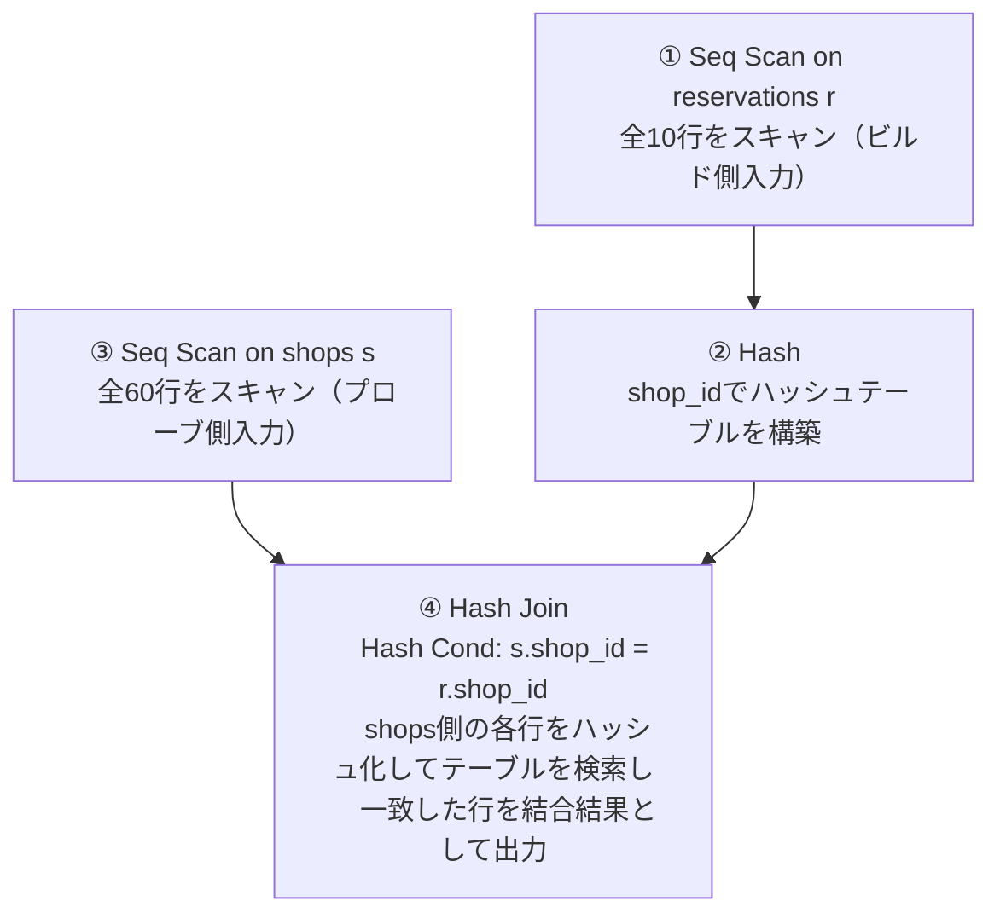
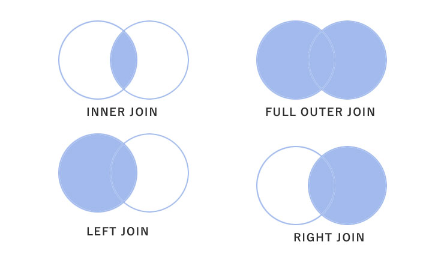

## 1. ログバッファ / データキャッシュ

- log buffer: 書き込み
- data cache: 読み込み
- data cache size >> log buffer size
- どちらのサイズもチューニング可能

## 2. Seq Scan vs Index Scan

### フルスキャン
```sql
EXPLAIN SELECT * FROM Shops;

Seq Scan on shops  (cost=0.00..1.60 rows=60 width=28)
```

### 条件検索（Index Scanになるはずだったが、テーブルが小さすぎてSeq Scanになった）
```sql
EXPLAIN SELECT *
  FROM Shops
  WHERE shop_id = '00050';

Seq Scan on shops  (cost=0.00..1.75 rows=1 width=28)
  Filter: (shop_id = '00050'::bpchar)
```

**なぜIndex ScanでなくSeq Scanになるか**

プランナは統計情報を使ってコストベースでSeq ScanとIndex Scanの推定コストを比較し、安い方を選ぶ。`shops`はrows=60で1ページに収まる程度に小さいテーブルのため、次の理由でSeq Scanの方が安くなる。

| 方式 | I/O |
|---|---|
| Seq Scan | ページを1回読むだけで全行取得できる |
| Index Scan | インデックスページを読んでから、目的行のあるヒープページを別途読みに行く（ランダムI/O） |

テーブルが小さいうちはSeq Scanの方がI/O回数が少なく済むため、`shop_id`にインデックスがあってもオプティマイザが使わない。データ量が増えれば（数千〜数万行）Index Scanに切り替わる。

**なぜ`rows=1`なのか**

`rows`は「スキャンした行数」ではなく「そのノードが出力する（フィルタ後に残る）行数の推定値」。Seq Scanはshopsの全60行を読むが、各行に`Filter: (shop_id = '00050'::bpchar)`を適用し条件に合わない行は捨てる。`rows=1`はフィルタ適用後の出力行数の推定であり、`shop_id`が主キー（一意）なのでプランナは一致する行が最大1行だと分かる。実際にスキャンされた行数は`EXPLAIN ANALYZE`の`actual rows`や`Rows Removed by Filter`で確認できる。

## 3. Hash Join（結合）

### ANALYZE前
```sql
EXPLAIN SELECT shop_name
  FROM Shops S INNER JOIN Reservations R
    ON S.shop_id = R.shop_id;

Hash Join  (cost=2.35..17.42 rows=120 width=8)
  Hash Cond: (r.shop_id = s.shop_id)
  ->  Seq Scan on reservations r  (cost=0.00..14.00 rows=400 width=24)
  ->  Hash  (cost=1.60..1.60 rows=60 width=14)
        ->  Seq Scan on shops s  (cost=0.00..1.60 rows=60 width=14)
```

実データ: shops=60件, reservations=10件（ただし推定は400件でズレている）

**なぜHash Joinが選ばれるか**

等値結合（`S.shop_id = R.shop_id`）なので、Nested Loop/Hash Join/Merge Joinの中からコスト最小の方式を選ぶ。小さい方の入力（shops, 推定60行）を先にハッシュテーブルとしてメモリに構築し、大きい方（reservations, 推定400行）を1回Seq Scanしながらプローブする（O(N+M)相当）。この方式はソートが必要なMerge Joinや、ループごとに検索が必要なNested Loopより安い。

コスト`2.35..17.42`の内訳:
- startup 2.35 ≒ shopsをスキャンしてハッシュテーブルを構築するコスト（1.60）+ 構築オーバーヘッド
- total 17.42 ≒ 上記 + reservationsのSeq Scanコスト（14.00）+ 各行のハッシュプローブのオーバーヘッド

**`rows=400`（reservations, 実際は10件）がズレる理由**

`rows`はノードが返すと推定した行数であり実際の行数ではない。この推定は`pg_class.reltuples`（行数統計）に基づくが、これは`ANALYZE`（またはautovacuum）が走らないと更新されない。`reservations`に`ANALYZE`が実行されていない/統計が古い状態だと、プランナは正確な行数を知らず物理ページ数などから大雑把に見積もる（今回は400）。実データが10件でも統計が古ければEXPLAIN上はズレた数字が出る。

```sql
-- 実際の行数(actual rows)と見積もり(rows)の差を確認
EXPLAIN ANALYZE SELECT shop_name FROM Shops S INNER JOIN Reservations R ON S.shop_id = R.shop_id;

-- 統計を更新する場合
ANALYZE Reservations;
```

**`rows=120`の内訳**

結合結果の推定行数は基本的に次の式で決まる。

```
join_rows ≒ outer_rows × inner_rows × 結合条件の選択率(selectivity)
```

`reservations.shop_id`に列統計（distinct値の情報）が無い場合、PostgreSQLは等値比較のデフォルト選択率定数 **0.005（=1/200）** を使う。

```
400 (reservations) × 60 (shops) × 0.005 = 120
```

`rows=120`は「本当の結合結果」ではなく、「統計不足によるreservationsの誤った推定行数(400)」と「統計が無い時のデフォルト選択率(0.005)」を掛け合わせた、二重にズレた推定値。統計（ANALYZE）が更新されていないとEXPLAINのコスト・行数推定は実データと大きくズレる好例であり、実務では定期的なANALYZE/autovacuumの実行が正しい実行計画選択のために重要。

### ANALYZE後
```sql
ANALYZE Reservations;

EXPLAIN SELECT shop_name
  FROM Shops S INNER JOIN Reservations R
    ON S.shop_id = R.shop_id;

Hash Join  (cost=1.23..3.23 rows=10 width=8)
  Hash Cond: (s.shop_id = r.shop_id)
  ->  Seq Scan on shops s  (cost=0.00..1.60 rows=60 width=14)
  ->  Hash  (cost=1.10..1.10 rows=10 width=6)
        ->  Seq Scan on reservations r  (cost=0.00..1.10 rows=10 width=6)
```

統計が正しくなり、ビルド側（実際に小さいreservations=10行）とプローブ側（shops=60行）が入れ替わった。「Hash Joinは(推定で)小さい方の入力をハッシュ化してメモリに載せる」という計画方針どおりの結果。`rows=10`も実データに近い推定になっている（reservationsの列統計が更新され、デフォルト選択率(0.005)ではなく実データに基づいた選択率が使われるようになったため）。

### 実行順序



**注意: 兄弟ノード（同じインデント）の上下の並び順は実行順序を意味しない**

EXPLAIN出力ではHash Joinは常に「1つ目の子＝プローブ側」「2つ目の子(Hashノード)＝ビルド側」の順で表示される。これは役割（外側/内側）を示す表示規則であり、実行順ではない。実行アルゴリズム上は必ず次の順序で動く。

1. ビルド側（`Hash`とその子`Seq Scan on reservations r`）を最後まで実行し、ハッシュテーブルを完成させる
2. その後プローブ側（`Seq Scan on shops s`）を1行ずつ読み、都度ハッシュテーブルを検索する

ハッシュテーブルが完成していないと検索できないため、ビルド側が必ず先に完了する必要がある。Nested Loopのように「1つ目の子が先、2つ目の子が後（かつ繰り返し）」と単純に読める結合方式とは異なり、Hash Joinはこの点で例外的。

一般化すると: ツリーは深い方（インデントが深い）から実行されるが、Hash Joinの2つの子（ビルド側/プローブ側）は表示上の並びに関わらずビルド側が先。

## 参考

**INNER JOIN（内部結合）**: 複数のテーブルを結合する際、結合条件（キーの値）が一致するデータ（レコード）だけを抽出して結びつける操作。



- Hash Joinを行うには`Hash Cond`（結合に使う列の等値比較条件）が必要
- `Hash Cond`を評価するために、結合に使う列の値を事前にハッシュ化しておく必要がある
