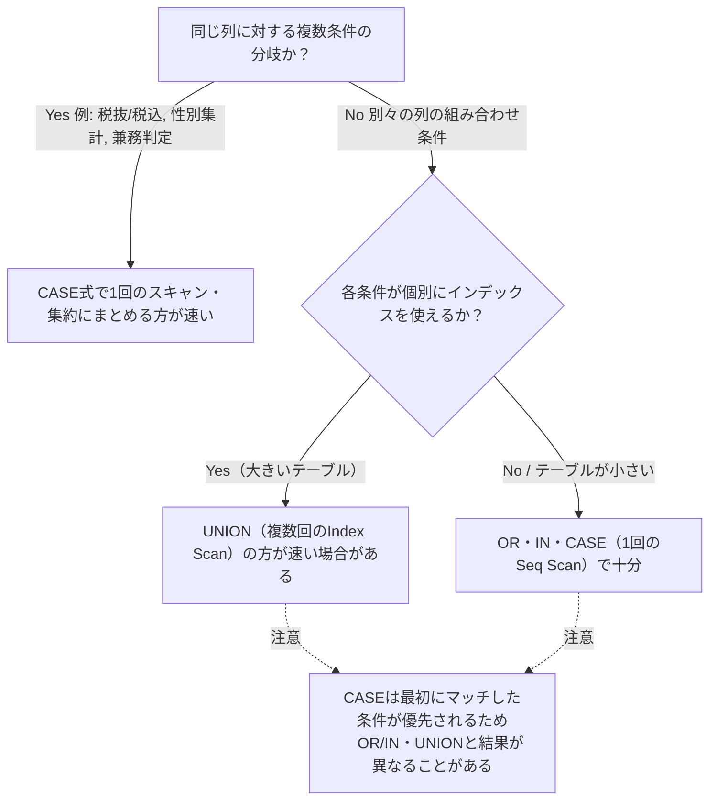

# SQL における条件分岐 文から式へ

## 1. UNION を使った冗長な表現

同じ列に対する複数条件の分岐はCASE式でまとめられる。UNIONで書くと同じテーブルを複数回スキャン・集約することになり冗長になりやすい。

### 例1: 税抜価格/税込価格の切り替え

2001年以前は税抜価格、2002年以降は税込価格を使う場合。

UNION ALLによる書き方:
```sql
SELECT item_name, year, price_tax_ex AS price
  FROM Items
 WHERE year <= 2001
UNION ALL
SELECT item_name, year, price_tax_in AS price
  FROM Items
 WHERE year >= 2002;
```

```sql
EXPLAIN
SELECT item_name, year, price_tax_ex as price
  FROM items
 WHERE year <= 2001
UNION ALL
SELECT item_name, year, price_tax_in as price
  FROM items
 WHERE year >= 2002;

Append  (cost=0.00..2.36 rows=12 width=47)
  ->  Seq Scan on items  (cost=0.00..1.15 rows=6 width=47)
        Filter: (year <= 2001)
  ->  Seq Scan on items items_1  (cost=0.00..1.15 rows=6 width=47)
        Filter: (year >= 2002)
```

同じテーブルを条件を変えて2回スキャンしている（Seq Scanが2回）。

SELECT句でCASE式を使えば1つのSELECT文で書ける:
```sql
SELECT item_name, year,
       CASE WHEN year <= 2001 THEN price_tax_ex
            WHEN year >= 2002 THEN price_tax_in END AS price
  FROM Items;
```

```sql
EXPLAIN
SELECT item_name, year,
       CASE WHEN year <= 2001 THEN price_tax_ex
            WHEN year >= 2002 THEN price_tax_in END AS price
  FROM items;

Seq Scan on items  (cost=0.00..1.18 rows=12 width=47)
```

Seq Scanは1度で済む。SQLにはIF文のような文単位の分岐は無く、CASE式という「式」で条件分岐を表現する（文単位ではなく式で考える）。

### 例2: 性別ごとの人口集計

UNIONによる解（NULLをプレースホルダにして列を作り、SUMで畳み込む）:
```sql
SELECT prefecture, SUM(pop_men) AS pop_men, SUM(pop_wom) AS pop_wom
  FROM (SELECT prefecture, pop AS pop_men, NULL AS pop_wom
          FROM Population
         WHERE sex = '1' -- 男性
        UNION
        SELECT prefecture, NULL AS pop_men, pop AS pop_wom
          FROM Population
         WHERE sex = '2') TMP -- 女性
 GROUP BY prefecture;
```

```sql
EXPLAIN
SELECT prefecture, SUM(pop_men) AS pop_men, SUM(pop_wom) AS pop_wom
  FROM (SELECT prefecture, pop AS pop_men, NULL AS pop_wom
          FROM Population
         WHERE sex = '1'
        UNION
        SELECT prefecture, NULL AS pop_men, pop AS pop_wom
          FROM Population
         WHERE sex = '2') TMP
 GROUP BY prefecture;

HashAggregate  (cost=2.55..2.65 rows=10 width=98)
  Group Key: population.prefecture
  ->  HashAggregate  (cost=2.38..2.48 rows=10 width=90)
        Group Key: population.prefecture, population.pop, (NULL::integer)
        ->  Append  (cost=0.00..2.30 rows=10 width=90)
              ->  Seq Scan on population  (cost=0.00..1.12 rows=5 width=15)
                    Filter: (sex = '1'::bpchar)
              ->  Seq Scan on population population_1  (cost=0.00..1.12 rows=5 width=15)
                    Filter: (sex = '2'::bpchar)
```

`UNION`（`ALL`なし）は重複排除が必要なため、内側のHashAggregateで重複チェックを行い、さらに外側のHashAggregateで`prefecture`ごとのSUMを計算している。Seq Scan 2回 + HashAggregate 2回と重い。

CASE式による解:
```sql
SELECT prefecture,
       SUM(CASE WHEN sex = '1' THEN pop ELSE 0 END) AS pop_men,
       SUM(CASE WHEN sex = '2' THEN pop ELSE 0 END) AS pop_wom
  FROM Population
 GROUP BY prefecture;
```

`ELSE 0`は、条件に該当しない行に対して`0`を返すという意味。`SUM`は値そのものを合計するため、非該当行の値は合計に影響を与えない値（加算の単位元である`0`）にしておく必要がある。

- **`ELSE 1`との違い**: `ELSE 1`にすると非該当行も`1`として合計に加算され、`pop_men`/`pop_wom`が誤った数値になる（例: `sex = '2'`の行1件につき`pop_men`が余分に+1される）。これは第2章の`COUNT(CASE WHEN cond THEN 1 END)`とは性質が違う点に注意。`COUNT`は「NULLかどうか」しか見ないため`THEN`の値は何でもよかったが、`SUM`では`THEN`/`ELSE`の値そのものが合計に使われるため、非該当行は合計を変化させない`0`でなければならない。
- **`ELSE`省略（暗黙の`NULL`）との違い**: `SUM`は`NULL`を無視するため通常は`ELSE 0`と同じ結果になるが、ある`prefecture`に該当する性別の行が1件も無い場合、`SUM(NULLのみ)`は`NULL`になるのに対し`SUM(0のみ)`は`0`になる。`ELSE 0`を明示することで、該当データが無いグループでも`NULL`でなく`0`を返せる。

```sql
EXPLAIN
SELECT prefecture,
       SUM(CASE WHEN sex = '1' THEN pop ELSE 0 END) AS pop_men,
       SUM(CASE WHEN sex = '2' THEN pop ELSE 0 END) AS pop_wom
  FROM Population
 GROUP BY prefecture;

HashAggregate  (cost=1.23..1.28 rows=5 width=23)
  Group Key: prefecture
  ->  Seq Scan on population  (cost=0.00..1.10 rows=10 width=13)
```

Seq Scan 1回 + HashAggregate 1回で済み、コストも約半分になる。

### 例3: 兼務しているチーム数でラベル付け

UNIONによる解:
```sql
SELECT emp_name,
       MAX(team) AS team
  FROM Employees
 GROUP BY emp_name
HAVING COUNT(*) = 1
UNION
SELECT emp_name,
       '2つを兼務' AS team
  FROM Employees
 GROUP BY emp_name
HAVING COUNT(*) = 2
UNION
SELECT emp_name,
       '3つ以上を兼務' AS team
  FROM Employees
 GROUP BY emp_name
HAVING COUNT(*) >= 3;
```

```sql
EXPLAIN
...

Unique  (cost=3.77..3.80 rows=4 width=100)
  ->  Sort  (cost=3.77..3.78 rows=4 width=100)
        Sort Key: employees.emp_name, (max(employees.team))
        ->  Append  (cost=1.19..3.73 rows=4 width=100)
              ->  HashAggregate  (cost=1.19..1.26 rows=1 width=49)
                    Group Key: employees.emp_name
                    Filter: (count(*) = 1)
                    ->  Seq Scan on employees  (cost=0.00..1.11 rows=11 width=39)
              ->  HashAggregate  (cost=1.17..1.23 rows=1 width=49)
                    Group Key: employees_1.emp_name
                    Filter: (count(*) = 2)
                    ->  Seq Scan on employees employees_1  (cost=0.00..1.11 rows=11 width=17)
              ->  HashAggregate  (cost=1.17..1.23 rows=2 width=49)
                    Group Key: employees_2.emp_name
                    Filter: (count(*) >= 3)
                    ->  Seq Scan on employees employees_2  (cost=0.00..1.11 rows=11 width=17)
```

GROUP BYとSeq Scanがそれぞれ3回に加え、`UNION`の重複排除のために`Sort`+`Unique`が発生している。3つの分岐は`COUNT(*)`の値で完全に排他なので重複は原理上起こり得ないが、`UNION`を使う以上プランナは律儀に重複排除を行う。

CASE式による解（集約関数の結果をCASE式で分岐させる）:
```sql
SELECT emp_name,
       CASE WHEN COUNT(*) = 1 THEN MAX(team) -- GROUP BY emp_name のため、集約関数を使わないとteamを1つの値に決められない
            WHEN COUNT(*) = 2 THEN '2つを兼務'
            WHEN COUNT(*) >= 3 THEN '3つ以上を兼務'
       END AS team
  FROM Employees
 GROUP BY emp_name;
```

```sql
EXPLAIN
SELECT emp_name,
       CASE WHEN COUNT(*) = 1 THEN MAX(team)
            WHEN COUNT(*) = 2 THEN '2つを兼務'
            WHEN COUNT(*) >= 3 THEN '3つ以上を兼務'
       END AS team
  FROM Employees
 GROUP BY emp_name;

HashAggregate  (cost=1.19..1.28 rows=5 width=49)
  Group Key: emp_name
  ->  Seq Scan on employees  (cost=0.00..1.11 rows=11 width=39)
```

Seq Scan 1回 + HashAggregate 1回で済む。

## 2. UNION の方が効率的な場合がある

CASE式が常に最適とは限らない。3組の日付・フラグ（`date_1/flg_1`, `date_2/flg_2`, `date_3/flg_3`）のいずれかが指定日付かつフラグ='T'である行を取得する場合を考える。

UNIONによる解（3つの単純な条件に分けて個別に検索し、結果を合わせる）:
```sql
SELECT key, name, date_1, flg_1, date_2, flg_2, date_3, flg_3
  FROM ThreeElements
 WHERE date_1 = '2013-11-01'
   AND flg_1 = 'T'
UNION
SELECT key, name, date_1, flg_1, date_2, flg_2, date_3, flg_3
  FROM ThreeElements
 WHERE date_2 = '2013-11-01'
   AND flg_2 = 'T'
UNION
SELECT key, name, date_1, flg_1, date_2, flg_2, date_3, flg_3
  FROM ThreeElements
 WHERE date_3 = '2013-11-01'
   AND flg_3 = 'T';
```

```sql
EXPLAIN
...

Unique  (cost=3.31..3.38 rows=3 width=154)
  ->  Sort  (cost=3.31..3.32 rows=3 width=154)
        Sort Key: threeelements.key, threeelements.name, threeelements.date_1, threeelements.flg_1, threeelements.date_2, threeelements.flg_2, threeelements.date_3, threeelements.flg_3
        ->  Append  (cost=0.00..3.29 rows=3 width=154)
              ->  Seq Scan on threeelements  (cost=0.00..1.09 rows=1 width=29)
                    Filter: ((date_1 = '2013-11-01'::date) AND (flg_1 = 'T'::bpchar))
              ->  Seq Scan on threeelements threeelements_1  (cost=0.00..1.09 rows=1 width=29)
                    Filter: ((date_2 = '2013-11-01'::date) AND (flg_2 = 'T'::bpchar))
              ->  Seq Scan on threeelements threeelements_2  (cost=0.00..1.09 rows=1 width=29)
                    Filter: ((date_3 = '2013-11-01'::date) AND (flg_3 = 'T'::bpchar))
```

今回はテーブルが小さいためSeq Scanになっているが、テーブルが大きければ各条件は列単位のインデックスでIndex Scanになる。以降はその前提（3つのIndex Scan）で比較する。

OR/INによる解（1回のスキャンにまとめる）:
```sql
SELECT key, name, date_1, flg_1, date_2, flg_2, date_3, flg_3
  FROM ThreeElements
 WHERE (date_1 = '2013-11-01' AND flg_1 = 'T')
    OR (date_2 = '2013-11-01' AND flg_2 = 'T')
    OR (date_3 = '2013-11-01' AND flg_3 = 'T');

SELECT key, name, date_1, flg_1, date_2, flg_2, date_3, flg_3
  FROM ThreeElements
 WHERE ('2013-11-01', 'T')
         IN ((date_1, flg_1),
             (date_2, flg_2),
             (date_3, flg_3));
```

```sql
EXPLAIN（OR / IN とも同じ計画）

Seq Scan on threeelements  (cost=0.00..1.15 rows=1 width=29)
  Filter: (((date_1 = '2013-11-01'::date) AND (flg_1 = 'T'::bpchar)) OR ((date_2 = '2013-11-01'::date) AND (flg_2 = 'T'::bpchar)) OR ((date_3 = '2013-11-01'::date) AND (flg_3 = 'T'::bpchar)))
```

複数列にまたがるOR/IN条件は1本のインデックスでは処理できないため、Seq Scanになる。

**UNION vs OR/IN**: UNIONは3回のIndex Scan、OR/INは1回のSeq Scanになる。テーブルが大きい場合、複合条件によるSeq Scanは全表走査になり非常に重くなる一方、UNION側は3回とも軽量なIndex Scanで済む。そのため、テーブルが大きい場合はUNIONの方が効率的である可能性が高い。

CASE式による解:
```sql
SELECT key, name, date_1, flg_1, date_2, flg_2, date_3, flg_3
  FROM ThreeElements
 WHERE (CASE WHEN date_1 = '2013-11-01' THEN flg_1
             WHEN date_2 = '2013-11-01' THEN flg_2
             WHEN date_3 = '2013-11-01' THEN flg_3
        ELSE NULL END) = 'T';
```

```sql
EXPLAIN
...

Seq Scan on threeelements  (cost=0.00..1.12 rows=1 width=29)
  Filter: (CASE WHEN (date_1 = '2013-11-01'::date) THEN flg_1 WHEN (date_2 = '2013-11-01'::date) THEN flg_2 WHEN (date_3 = '2013-11-01'::date) THEN flg_3 ELSE NULL::bpchar END = 'T'::bpchar)
```

OR/INと同じくSeq Scanになる。

**注意: CASE式はOR/INと結果が異なる場合がある**

演習用に追加する行:
```sql
-- 演習問題3で追加するデータ
INSERT INTO ThreeElements VALUES ('7', 'g', '2013-11-01', 'F', NULL, NULL, '2013-11-01', 'T');
```

| key | name | date_1 | flg_1 | date_2 | flg_2 | date_3 | flg_3 |
|---|---|---|---|---|---|---|---|
| 1 | a | 2013/11/01 | T | | | | |
| 2 | b | | | 2013/11/01 | T | | |
| 3 | c | | | 2013/11/01 | F | | |
| 4 | d | | | 2013/12/30 | T | | |
| 5 | e | | | | | 2013/11/01 | T |
| 6 | f | | | | | 2013/12/01 | F |
| 7 | g | 2013/11/01 | F | | | 2013/11/01 | T |

7行目（`g`）は`date_1`と`date_3`の両方が対象日付だが、`flg_1='F'`、`flg_3='T'`で食い違っている。

- UNION / OR・IN: `date_3`かつ`flg_3='T'`の条件で一致するため、7行目は結果に**含まれる**
- CASE式: 最初にマッチした`WHEN date_1 = '2013-11-01' THEN flg_1`が採用され、`flg_1`（='F'）が返る。`date_3`側が本来条件を満たしていても無視されるため、7行目は結果から**除外される**

UNIONとOR/INは常に同値になるが、CASE式は「最初にマッチした条件が優先される」という短絡評価の性質があるため、複数列にまたがる分岐では結果が異なる場合がある。

## まとめ



- 同じ列の条件分岐（例1〜3）は迷わずCASE式で1本化する
- 複数列にまたがる条件（例4）は、テーブルが大きくインデックスが効くならUNIONが有利な場合がある
- ただしCASE式は最初にマッチしたWHENで確定する短絡評価のため、OR/IN・UNIONとは結果自体が異なりうる。単なる書き換えとして置き換える前に結果の一致を確認する
