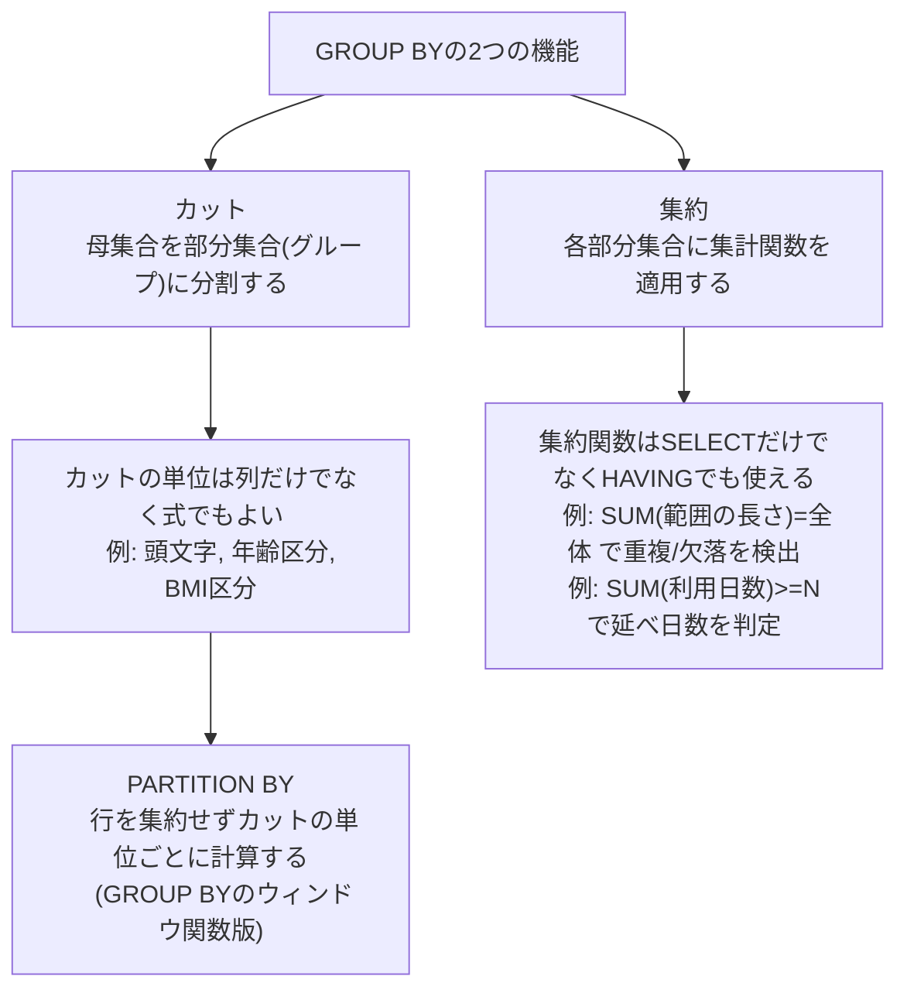

# 集約とカット 集合の世界

## 1. 集約

### 行持ちを列持ちに変換する（CASE + MAX）

idごとに、`data_type`が`A`の行から`data_1`/`data_2`、`B`の行から`data_3`/`data_4`/`data_5`、`C`の行から`data_6`を取り出し、1行にまとめたい（行持ちのデータを列持ちに変換する）。

| id |data_type|data_1|data_2|data_3|data_4|data_5|data_6|
|---|---|---|---|---|---|---|---|
|Jim|A|100|10|34|346|54| |
|Jim|B|45|2|167|77|90|157|
|Jim|C| |3|687|1355|324|457|
|Ken|A|78|5|724|457||1|
|Ken|B|123|12|178|346|85|235|
|Ken|C|45||23|46|687|33|
|Beth|A|75|0|190|25|356| |
|Beth|B|435|0|183||4|325|
|Beth|C|96|128||0|0|12|

惜しいが間違い（`GROUP BY id`のもとで、集約されていない`data_type`に依存する式をそのままSELECTしているためエラーになる）:
```sql
SELECT id,
       CASE WHEN data_type = 'A' THEN data_1 ELSE NULL END AS data_1,
       CASE WHEN data_type = 'A' THEN data_2 ELSE NULL END AS data_2,
       CASE WHEN data_type = 'B' THEN data_3 ELSE NULL END AS data_3,
       CASE WHEN data_type = 'B' THEN data_4 ELSE NULL END AS data_4,
       CASE WHEN data_type = 'B' THEN data_5 ELSE NULL END AS data_5,
       CASE WHEN data_type = 'C' THEN data_6 ELSE NULL END AS data_6
  FROM NonAggTbl
 GROUP BY id;
```

`GROUP BY`を使った場合、SELECT文に書けるのは以下の3種類のみ。
- 定数
- GROUP BY句で指定した集約キー（列）
- 集約関数

`data_type`はどれにも当たらないため、集約関数（`MAX`）で包む必要がある。これが正解:
```sql
SELECT id,
       MAX(CASE WHEN data_type = 'A' THEN data_1 ELSE NULL END) AS data_1,
       MAX(CASE WHEN data_type = 'A' THEN data_2 ELSE NULL END) AS data_2,
       MAX(CASE WHEN data_type = 'B' THEN data_3 ELSE NULL END) AS data_3,
       MAX(CASE WHEN data_type = 'B' THEN data_4 ELSE NULL END) AS data_4,
       MAX(CASE WHEN data_type = 'B' THEN data_5 ELSE NULL END) AS data_5,
       MAX(CASE WHEN data_type = 'C' THEN data_6 ELSE NULL END) AS data_6
  FROM NonAggTbl
 GROUP BY id;
```

idごとに対象外の行は全てNULLになるため、`MAX`はその中の唯一の非NULL値（無ければNULL）を返す。結果:

| id | data_1 | data_2 | data_3 | data_4 | data_5 | data_6 |
|---|---|---|---|---|---|---|
| Jim | 100 | 10 | 167 | 77 | 90 | 457 |
| Ken | 78 | 5 | 178 | 346 | 85 | 33 |
| Beth | 75 | 0 | 183 | | 4 | 12 |

```sql
EXPLAIN

HashAggregate  (cost=1.38..1.41 rows=3 width=28)
  Group Key: id
  ->  Seq Scan on nonaggtbl  (cost=0.00..1.09 rows=9 width=30)
```

### GROUP BYの実行方式とメモリ

`GROUP BY`は、GROUP BYに指定した列をハッシュ関数にかけてそのハッシュ値ごとに集約する`HashAggregate`が使われることが最近は多い（事前にソートしてから集約する方式より高速なことが多い）。

注意: ハッシュ・ソート用のワーキングメモリ（`work_mem`）が不足すると、一時領域のディスクを使って不足分をカバーしようとし、著しくパフォーマンスが低下することがある（俗に「TEMP落ち」と呼ばれる）。`GROUP BY`（集約関数）を使う際は十分な性能試験を実施する必要がある。

### SUM + HAVINGで範囲の重複・欠落を検出する

年齢帯ごとの価格テーブル。年齢帯が重複・欠落なく0〜100歳（101年分）を覆っているかを、`SUM(high_age - low_age + 1)`が101と一致するかで判定できる。重複があれば101より大きく、欠落があれば101より小さくなる。

| product_id | low_age | high_age | price |
|---|---|---|---|
|製品1|0|50|2000|
|製品1|51|100|3000|
|製品2|0|100|4200|
|製品3|0|20|500|
|製品3|31|70|800|
|製品3|71|100|1000|
|製品4|0|99|8900|

```sql
SELECT product_id
  FROM PriceByAge
 GROUP BY product_id
HAVING SUM(high_age - low_age + 1) = 101;
```

| product_id | 年数の合計 | 判定 |
|---|---|---|
| 製品1 | 101 | 重複・欠落なし |
| 製品2 | 101 | 重複・欠落なし |
| 製品3 | 91 | 21〜30歳が欠落 |
| 製品4 | 100 | 100歳が欠落 |

`HAVING`の条件を満たすのは製品1と製品2のみ。

### SUM + HAVINGで延べ利用日数を判定する

複数の予約レコードから、部屋ごとの延べ稼働日数を算出し、10日以上稼働している部屋を抽出する。

| room_nbr | start_date | end_date |
| --- | --- | --- |
| 101 | 2008-02-01 | 2008-02-06 |
| 101 | 2008-02-06 | 2008-02-08 |
| 101 | 2008-02-10 | 2008-02-13 |
| 202 | 2008-02-05 | 2008-02-08 |
| 202 | 2008-02-08 | 2008-02-11 |
| 202 | 2008-02-11 | 2008-02-12 |
| 303 | 2008-02-03 | 2008-02-17 |

```sql
SELECT room_nbr,
       SUM(end_date - start_date) AS working_days
  FROM HotelRooms
 GROUP BY room_nbr
HAVING SUM(end_date - start_date) >= 10;
```

| room_nbr | 稼働日数の合計 |
|---|---|
| 101 | 10 |
| 202 | 7 |
| 303 | 14 |

`HAVING`の条件を満たすのはroom_nbr 101と303（202は7日のため除外）。

## 2. カット

`GROUP BY`句には以下の2つの機能がある。
- **カット**: 母集合である元のテーブルを小さな部分集合（グループ）に分割する機能
- **集約**: 各部分集合に集計関数を適用し、集計結果を得る機能

カットの単位は列そのものだけでなく、列を使った式（CASE式など）にもできる。

人物テーブルのサンプル:
| name | age | height | weight |
|---|---|---|---|
| Anderson | 30 | 188 | 90 |
| Adela | 21 | 167 | 55 |
| Bates | 87 | 158 | 48 |
| Becky | 54 | 187 | 70 |
| Bill | 39 | 177 | 120 |
| Chris | 90 | 175 | 48 |
| Darwin | 12 | 160 | 55 |
| Dawson | 25 | 182 | 90 |
| Donald | 30 | 176 | 53 |

### 頭文字によるカット

頭文字のアルファベットごとに何人がテーブルに存在するか集計する:
```sql
SELECT SUBSTRING(name, 1, 1) AS label,
       COUNT(*)
  FROM Persons
 GROUP BY SUBSTRING(name, 1, 1)
ORDER BY label;
```
| label | count |
|---|---|
| A | 2 |
| B | 3 |
| C | 1 |
| D | 3 |

### 年齢区分によるカット

CASE式の結果でグループ化することで、年齢による区分ごとに集計できる:
```sql
SELECT (CASE WHEN age < 20 THEN '子供'
             WHEN age BETWEEN 20 AND 69 THEN '成人'
             WHEN age >= 70 THEN '老人'
             ELSE NULL END) AS age_class,
       COUNT(*)
  FROM Persons
 GROUP BY (CASE WHEN age < 20 THEN '子供'
                WHEN age BETWEEN 20 AND 69 THEN '成人'
                WHEN age >= 70 THEN '老人'
                ELSE NULL END);
```

| age_class | count |
|---|---|
| 子供 | 1 |
| 老人 | 2 |
| 成人 | 6 |

```sql
EXPLAIN

HashAggregate  (cost=1.23..1.39 rows=8 width=40)
  Group Key: CASE WHEN (age < 20) THEN '子供'::text WHEN ((age >= 20) AND (age <= 69)) THEN '成人'::text WHEN (age >= 70) THEN '老人'::text ELSE NULL::text END
  ->  Seq Scan on persons  (cost=0.00..1.18 rows=9 width=32)
```

Seq Scan後にCASE式の評価（列の計算）のオーバーヘッドは発生するが、データへのアクセスパス自体には影響しない。

### BMIによるカット

同様に、身長・体重から計算したBMIで体型を分類できる:
```sql
SELECT (CASE WHEN weight / POWER(height / 100, 2) < 18.5 THEN 'やせ'
             WHEN 18.5 <= weight / POWER(height / 100, 2)
              AND weight / POWER(height / 100, 2) < 25 THEN '標準'
             WHEN 25 <= weight / POWER(height / 100, 2) THEN '肥満'
             ELSE NULL END) AS bmi,
       COUNT(*)
  FROM Persons
 GROUP BY (CASE WHEN weight / POWER(height / 100, 2) < 18.5 THEN 'やせ'
                WHEN 18.5 <= weight / POWER(height / 100, 2)
                 AND weight / POWER(height / 100, 2) < 25 THEN '標準'
                WHEN 25 <= weight / POWER(height / 100, 2) THEN '肥満'
                ELSE NULL END);
```

| bmi | count |
|---|---|
| やせ | 2 |
| 肥満 | 3 |
| 標準 | 4 |

### PARTITION BY句を使ったカット

`PARTITION BY`にも式を入れられる。行を集約して1行に畳み込む`GROUP BY`とは異なり、`PARTITION BY`は行を保ったまま「カットの単位ごとの計算」（ここではランキング）を行う。

```sql
SELECT age,
       (CASE WHEN age < 20 THEN '子供'
             WHEN age BETWEEN 20 AND 69 THEN '成人'
             WHEN age >= 70 THEN '老人'
             ELSE NULL END) AS age_class,
       RANK() OVER(PARTITION BY (CASE WHEN age < 20 THEN '子供'
                                       WHEN age BETWEEN 20 AND 69 THEN '成人'
                                       WHEN age >= 70 THEN '老人'
                                       ELSE NULL END)
                   ORDER BY age) AS age_rank_in_class
  FROM Persons
 ORDER BY age_class, age_rank_in_class;
```

`ORDER BY`には複数の列を指定でき、ここでは`age_class`, `age_rank_in_class`の順でソートされる。

| age | age_class | age_rank_in_class |
|---|---|---|
| 12 | 子供 | 1 |
| 21 | 成人 | 1 |
| 25 | 成人 | 2 |
| 30 | 成人 | 3 |
| 30 | 成人 | 3 |
| 39 | 成人 | 5 |
| 54 | 成人 | 6 |
| 87 | 老人 | 1 |
| 90 | 老人 | 2 |

`RANK`は同順位（ここでは30歳が2人）に同じ順位を与え、次の順位を1つ飛ばす（3位が2人いるため次は5位になる）。

```sql
EXPLAIN

Incremental Sort  (cost=1.37..1.96 rows=9 width=44)
  Sort Key: (CASE WHEN (age < 20) THEN '子供'::text WHEN ((age >= 20) AND (age <= 69)) THEN '成人'::text WHEN (age >= 70) THEN '老人'::text ELSE NULL::text END), (rank() OVER w1)
  Presorted Key: (CASE WHEN (age < 20) THEN '子供'::text WHEN ((age >= 20) AND (age <= 69)) THEN '成人'::text WHEN (age >= 70) THEN '老人'::text ELSE NULL::text END)
  ->  WindowAgg  (cost=1.32..1.59 rows=9 width=44)
        Window: w1 AS (PARTITION BY (CASE WHEN (age < 20) THEN '子供'::text WHEN ((age >= 20) AND (age <= 69)) THEN '成人'::text WHEN (age >= 70) THEN '老人'::text ELSE NULL::text END) ORDER BY age ROWS UNBOUNDED PRECEDING)
        ->  Sort  (cost=1.32..1.35 rows=9 width=36)
              Sort Key: (CASE WHEN (age < 20) THEN '子供'::text WHEN ((age >= 20) AND (age <= 69)) THEN '成人'::text WHEN (age >= 70) THEN '老人'::text ELSE NULL::text END), age
              ->  Seq Scan on persons  (cost=0.00..1.18 rows=9 width=36)
```

## まとめ



- `GROUP BY`を使うとSELECT文に書けるのは定数・集約キー・集約関数の3種類だけ。それ以外の式を使いたい場合は集約関数（`MAX`など）で包む
- カットの単位は式でもよいため、CASE式でのグループ化や`PARTITION BY`への応用が効く
- `HAVING`と集約関数を組み合わせると、範囲の重複・欠落チェックや延べ利用日数の判定のような集合演算的なチェックができる
