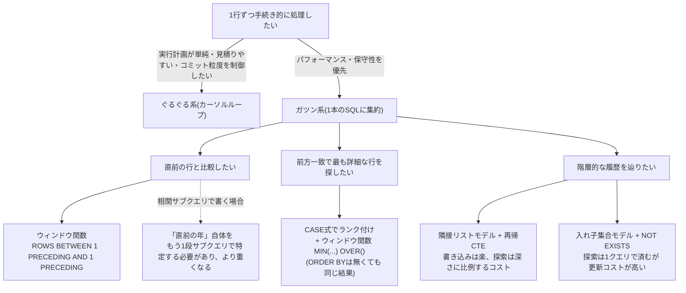

# ループ 手続き型の呪縛

## 1. 前年比を判定する（ぐるぐる系 vs ガツン系）

売り上げ計算を行うテーブルのサンプル:
| company | year | sale |
|---------|------|------|
| A | 2002 | 50 |
| A | 2003 | 52 |
| A | 2004 | 55 |
| A | 2007 | 55 |
| B | 2001 | 27 |
| B | 2005 | 28 |
| B | 2006 | 28 |
| B | 2009 | 30 |
| C | 2001 | 40 |
| C | 2005 | 39 |
| C | 2006 | 38 |
| C | 2010 | 35 |

各行について「同じ会社の前年と比べて増えたか(+)・減ったか(-)・同じか(=)」を`var`として求めたい。

### ぐるぐる系（カーソルで1行ずつループ処理）

Oracle PL/SQLのカーソルループによる擬似コード（このリポジトリのPostgreSQL環境では動かない書き方だが、手続き型アプローチの典型例として引用）:
```sql
CREATE OR REPLACE PROCEDURE PROC_INSERT_VAR
IS

  /* カーソル宣言 */
  CURSOR c_sales IS
       SELECT company, year, sale
         FROM Sales
        ORDER BY company, year;

  /* レコードタイプ宣言 */
  rec_sales c_sales%ROWTYPE;

  /* カウンタ */
  i_pre_sale INTEGER := 0;
  c_company CHAR(1) := '*';
  c_var CHAR(1) := '*';

BEGIN

OPEN c_sales;

  LOOP
    /* レコードをフェッチして変数に代入 */
    fetch c_sales into rec_sales;
    /* レコードがなくなったらループ終了 */
    exit when c_sales%notfound;

    IF (c_company = rec_sales.company) THEN
        /* 直前のレコードが同じ会社のレコードの場合 */
        /* 直前のレコードと売り上げを比較*/
        IF (i_pre_sale < rec_sales.sale) THEN
            c_var := '+';
        ELSIF (i_pre_sale > rec_sales.sale) THEN
            c_var := '-';
        ELSE
            c_var := '=';
        END IF;

    ELSE
        c_var := NULL;
    END IF;

    /* 登録先テーブルにデータを登録 */
    INSERT INTO Sales2 (company, year, sale, var)
      VALUES (rec_sales.company, rec_sales.year, rec_sales.sale, c_var);

    c_company := rec_sales.company;
    i_pre_sale := rec_sales.sale;

  END LOOP;

  CLOSE c_sales;
  commit;
END;
```

これに対して、これ以上ないくらい単純なSQL文（1件取得するだけ）と比較すると、ループ処理はSQLを大量に単純な形で繰り返し呼び出しているだけとも言える:
```sql
SELECT col_a FROM Foo WHERE p_key = 1;
```

ぐるぐる系の利点:
- 実行計画がシンプルになり、変動リスクがほとんどない（逆にガツン系は複雑な実行計画になりやすく、変動リスクも高い）
- 処理時間の見積もりがガツン系と比べて容易。処理時間 = 1回あたりの実行時間 × 実行回数
- トランザクションの粒度を細かく制御できる。例えば更新処理をループで行い、一定回数ごとにコミットすれば、エラーが起きても直前のコミットまでの処理は確定しているため影響を最小限に抑えられる

### ガツン系（ウィンドウ関数で1つのSQL文にする）

```sql
SELECT company,
       year,
       sale,
       CASE SIGN(sale - MAX(sale)
                          OVER(PARTITION BY company
                               ORDER BY year
                               ROWS BETWEEN 1 PRECEDING AND 1 PRECEDING)
       ) WHEN 0 THEN '='
         WHEN 1 THEN '+'
         WHEN -1 THEN '-'
         ELSE NULL END AS var
  FROM Sales;
```

| company | year | sale | var |
|---------|------|------|-----|
| A       | 2002 | 50   | NULL|
| A       | 2003 | 52   | +   |
| A       | 2004 | 55   | +   |
| A       | 2007 | 55   | =   |
| B       | 2001 | 27   | NULL|
| B       | 2005 | 28   | +   |
| B       | 2006 | 28   | =   |
| B       | 2009 | 30   | +   |
| C       | 2001 | 40   | NULL|
| C       | 2005 | 39   | -   |
| C       | 2006 | 38   | -   |
| C       | 2010 | 35   | -   |

```sql
EXPLAIN

WindowAgg  (cost=1.36..1.76 rows=12 width=42)
  Window: w1 AS (PARTITION BY company ORDER BY year ROWS BETWEEN '1'::bigint PRECEDING AND '1'::bigint PRECEDING)
  ->  Sort  (cost=1.34..1.37 rows=12 width=10)
        Sort Key: company, year
        ->  Seq Scan on sales  (cost=0.00..1.12 rows=12 width=10)
```

- `SIGN`関数: 引数が正なら1、負なら-1、0なら0を返す
- `ROWS BETWEEN`: 現在行を基準に前後の行を指定するオプション。`1 PRECEDING AND 1 PRECEDING`は「直前の1行だけ」を対象にする
- `MAX`という集約関数に`OVER`句で範囲を1行だけに絞って指定することで、実質的に「直前の行の値を取得する」ウィンドウ関数として使える

同じ考え方で「1行前の会社名」と「1行前の売り上げ」を別列として取得することもできる:
```sql
SELECT company,
       year,
       sale,
       MAX(company) OVER(PARTITION BY company ORDER BY year ROWS BETWEEN 1 PRECEDING AND 1 PRECEDING) AS pre_company,
       MAX(sale)  OVER(PARTITION BY company ORDER BY year ROWS BETWEEN 1 PRECEDING AND 1 PRECEDING) AS pre_sale
  FROM Sales;
```

| company | year | sale | pre_company | pre_sale |
|---------|------|------|-------------|----------|
| A       | 2002 | 50   | NULL        | NULL     |
| A       | 2003 | 52   | A           | 50       |
| A       | 2004 | 55   | A           | 52       |
| A       | 2007 | 55   | A           | 55       |
| B       | 2001 | 27   | NULL        | NULL     |
| B       | 2005 | 28   | B           | 27       |
| B       | 2006 | 28   | B           | 28       |
| B       | 2009 | 30   | B           | 28       |
| C       | 2001 | 40   | NULL        | NULL     |
| C       | 2005 | 39   | C           | 40       |
| C       | 2006 | 38   | C           | 39       |
| C       | 2010 | 35   | C           | 38       |

### 相関サブクエリ版

同じ`var`を相関サブクエリで求める場合、「直前の年」自体をもう1段階のサブクエリで特定した上で、その年の売上と比較する必要がある:
```sql
INSERT INTO Sales2
SELECT company,
        year,
        sale,
        CASE SIGN(sale - (SELECT sale -- 直近の年の売り上げを選択
                            FROM Sales SL2
                           WHERE SL1.company = SL2.company
                             AND SL2.year =
                               (SELECT MAX(year)  -- 直近の年を選択
                                  FROM Sales SL3
                                 WHERE SL1.company = SL3.company
                                   AND SL1.year > SL3.year )))
        WHEN 0  THEN '='
        WHEN 1  THEN '+'
        WHEN -1 THEN '-'
        ELSE NULL END AS var
   FROM Sales SL1;
```

```sql
EXPLAIN

Seq Scan on sales sl1  (cost=0.00..29.77 rows=12 width=42)
  SubPlan 2
    ->  Seq Scan on sales sl2  (cost=1.19..2.37 rows=1 width=4)
          Filter: ((sl1.company = company) AND (year = (InitPlan 1).col1))
          InitPlan 1
            ->  Aggregate  (cost=1.18..1.19 rows=1 width=4)
                  ->  Seq Scan on sales sl3  (cost=0.00..1.18 rows=1 width=4)
                        Filter: ((sl1.year > year) AND (sl1.company = company))
```

ウィンドウ関数版（cost 1.36..1.76）に対してこちらはcost 29.77と大きく重くなる。相関サブクエリは「直前の年」を特定するサブクエリと、その年の売上を取得するサブクエリの2段構えになり、テーブルを複数回スキャンした上に結合も発生するため、ウィンドウ関数より効率が悪くなる。

## 2. 前方一致で最も詳細な一致を検索する

郵便番号テーブルのサンプル:
| pcode | district_name |
|-------|---------------|
| 4130001 | 静岡県熱海市泉 |
| 4130002 | 静岡県熱海市伊豆山 |
| 4130103 | 静岡県熱海市網代 |
| 4130041 | 静岡県熱海市青葉町 |
| 4103213 | 静岡県伊豆市青羽根 |
| 4380824 | 静岡県磐田市赤池 |

目的の郵便番号`4130033`と前方一致する桁数が最も長い（最も詳細に一致する）郵便番号を検索したい。まず、一致の詳細さをCASE式でランク付けする:
```sql
SELECT pcode,
       district_name,
       CASE WHEN pcode = '4130033' THEN 0
            WHEN pcode LIKE '413003%' THEN 1
            WHEN pcode LIKE '41300%'  THEN 2
            WHEN pcode LIKE '4130%'   THEN 3
            WHEN pcode LIKE '413%'    THEN 4
            WHEN pcode LIKE '41%'     THEN 5
            WHEN pcode LIKE '4%'      THEN 6
            ELSE NULL END AS rank
  FROM PostalCode;
```

値が小さいほど詳細に一致している（0が完全一致）。この最小値を求めれば、最も近い郵便番号が分かる。

### スカラサブクエリ版

```sql
SELECT pcode,
       district_name
  FROM PostalCode
 WHERE CASE WHEN pcode = '4130033' THEN 0
            WHEN pcode LIKE '413003%' THEN 1
            WHEN pcode LIKE '41300%'  THEN 2
            WHEN pcode LIKE '4130%'   THEN 3
            WHEN pcode LIKE '413%'    THEN 4
            WHEN pcode LIKE '41%'     THEN 5
            WHEN pcode LIKE '4%'      THEN 6
            ELSE NULL END =
                (SELECT MIN(CASE WHEN pcode = '4130033' THEN 0
                                 WHEN pcode LIKE '413003%' THEN 1
                                 WHEN pcode LIKE '41300%'  THEN 2
                                 WHEN pcode LIKE '4130%'   THEN 3
                                 WHEN pcode LIKE '413%'    THEN 4
                                 WHEN pcode LIKE '41%'     THEN 5
                                 WHEN pcode LIKE '4%'      THEN 6
                                 ELSE NULL END)
                   FROM PostalCode);
```
| pcode | district_name |
|-------|---------------|
| 4130001 | 静岡県熱海市泉 |
| 4130002 | 静岡県熱海市伊豆山 |
| 4130041 | 静岡県熱海市青葉町 |

```sql
EXPLAIN

Seq Scan on postalcode  (cost=1.19..2.37 rows=1 width=34)
  Filter: (CASE WHEN (pcode = '4130033'::bpchar) THEN 0 WHEN (pcode ~~ '413003%'::text) THEN 1 WHEN (pcode ~~ '41300%'::text) THEN 2 WHEN (pcode ~~ '4130%'::text) THEN 3 WHEN (pcode ~~ '413%'::text) THEN 4 WHEN (pcode ~~ '41%'::text) THEN 5 WHEN (pcode ~~ '4%'::text) THEN 6 ELSE NULL::integer END = (InitPlan 1).col1)
  InitPlan 1
    ->  Aggregate  (cost=1.18..1.19 rows=1 width=4)
          ->  Seq Scan on postalcode postalcode_1  (cost=0.00..1.06 rows=6 width=8)
```

各行でCASE式は最大7つの分岐（等価比較1つ＋LIKE比較6つ）を評価する。加えてSeq Scanが2回実行されている点がまだ最適ではない。2回になる理由は、`WHERE`側のCASE式評価用のスキャンとは別に、サブクエリで`MIN`を求めるためにPostalCodeテーブルをもう一度スキャンしているから。

### ウィンドウ関数版

```sql
SELECT pcode,
       district_name
  FROM (SELECT pcode,
               district_name,
               CASE WHEN pcode = '4130033' THEN 0
                    WHEN pcode LIKE '413003%' THEN 1
                    WHEN pcode LIKE '41300%'  THEN 2
                    WHEN pcode LIKE '4130%'   THEN 3
                    WHEN pcode LIKE '413%'    THEN 4
                    WHEN pcode LIKE '41%'     THEN 5
                    WHEN pcode LIKE '4%'      THEN 6
                    ELSE NULL END AS hit_code,
               MIN(CASE WHEN pcode = '4130033' THEN 0
                        WHEN pcode LIKE '413003%' THEN 1
                        WHEN pcode LIKE '41300%'  THEN 2
                        WHEN pcode LIKE '4130%'   THEN 3
                        WHEN pcode LIKE '413%'    THEN 4
                        WHEN pcode LIKE '41%'     THEN 5
                        WHEN pcode LIKE '4%'      THEN 6
                        ELSE NULL END)
                OVER(ORDER BY CASE WHEN pcode = '4130033' THEN 0
                                   WHEN pcode LIKE '413003%' THEN 1
                                   WHEN pcode LIKE '41300%'  THEN 2
                                   WHEN pcode LIKE '4130%'   THEN 3
                                   WHEN pcode LIKE '413%'    THEN 4
                                   WHEN pcode LIKE '41%'     THEN 5
                                   WHEN pcode LIKE '4%'      THEN 6
                                   ELSE NULL END) AS min_code
          FROM PostalCode) Foo
 WHERE hit_code = min_code;
```
| pcode | district_name |
|-------|---------------|
| 4130001 | 静岡県熱海市泉 |
| 4130002 | 静岡県熱海市伊豆山 |
| 4130041 | 静岡県熱海市青葉町 |

```sql
EXPLAIN

Subquery Scan on foo  (cost=1.28..1.63 rows=1 width=34)
  Filter: (foo.hit_code = foo.min_code)
  ->  WindowAgg  (cost=1.28..1.56 rows=6 width=42)
        Window: w1 AS (ORDER BY (CASE WHEN (postalcode.pcode = '4130033'::bpchar) THEN 0 WHEN (postalcode.pcode ~~ '413003%'::text) THEN 1 WHEN (postalcode.pcode ~~ '41300%'::text) THEN 2 WHEN (postalcode.pcode ~~ '4130%'::text) THEN 3 WHEN (postalcode.pcode ~~ '413%'::text) THEN 4 WHEN (postalcode.pcode ~~ '41%'::text) THEN 5 WHEN (postalcode.pcode ~~ '4%'::text) THEN 6 ELSE NULL::integer END))
        ->  Sort  (cost=1.24..1.26 rows=6 width=38)
              Sort Key: (CASE WHEN (postalcode.pcode = '4130033'::bpchar) THEN 0 WHEN (postalcode.pcode ~~ '413003%'::text) THEN 1 WHEN (postalcode.pcode ~~ '41300%'::text) THEN 2 WHEN (postalcode.pcode ~~ '4130%'::text) THEN 3 WHEN (postalcode.pcode ~~ '413%'::text) THEN 4 WHEN (postalcode.pcode ~~ '41%'::text) THEN 5 WHEN (postalcode.pcode ~~ '4%'::text) THEN 6 ELSE NULL::integer END)
              ->  Seq Scan on postalcode  (cost=0.00..1.17 rows=6 width=38)
```

テーブルへのフルスキャンが1回に減った。ウィンドウ関数がソートを必要とする分のコストはかかるが、テーブルサイズが大きい場合はテーブルスキャンを減らせる方が有利になる。

内側のSELECTだけを実行すると、各行の`hit_code`と、ウィンドウ関数が計算した`min_code`（全行共通で2）が見える:
| pcode | district_name | hit_code | min_code |
|-------|---------------|----------|----------|
| 4130001 | 静岡県熱海市泉       | 2        | 2        |
| 4130002 | 静岡県熱海市伊豆山   | 2        | 2        |
| 4130103 | 静岡県熱海市網代     | 3        | 2        |
| 4130041 | 静岡県熱海市青葉町   | 2        | 2        |
| 4103213 | 静岡県伊豆市青羽根   | 5        | 2        |
| 4380824 | 静岡県磐田市赤池     | 6        | 2        |

外側の`WHERE hit_code = min_code`で`hit_code`が2の3行（4130001, 4130002, 4130041）だけが残る。

**考察: `OVER(ORDER BY ...)`は本当に必要か**

上記は`MIN(hit_code) OVER(ORDER BY hit_code)`だが、`ORDER BY`を外した`MIN(hit_code) OVER()`でも結果は完全に同じになる。

理由: `OVER(ORDER BY X)`にフレーム指定が無い場合、デフォルトフレームは`RANGE BETWEEN UNBOUNDED PRECEDING AND CURRENT ROW`になる。`ORDER BY`が集約対象の`X`自身（ここでは`hit_code`）なので、値が`k`の行のフレームは「`X <= k`であるすべての行」になる。全体最小値を`M`とすると、定義上どの行の`k`に対しても`M <= k`が成り立つため、**どの行のフレームにも必ず`M`を達成する行が含まれる**。したがって`MIN(X) OVER(ORDER BY X)`はどの行でも常に全体最小値`M`になり、`ORDER BY`無しの`MIN(X) OVER()`（デフォルトでパーティション全体がフレームになる）と一致する。

この一致は「`MIN`を、それ自身が使う式で昇順に`ORDER BY`する」という特殊な組み合わせだから成り立つものであり、一般化できるテクニックではない（`SUM`/`AVG`や、降順での`MIN`・昇順での`MAX`では行ごとに異なる累積値になり、全体集約とは一致しない）。

`ORDER BY`を外すとプランナは`Sort`が不要になり、`WindowAgg`の前段の`Sort`ノードが消える分さらに効率的になる:
```sql
SELECT pcode,
       district_name
  FROM (SELECT pcode,
               district_name,
               CASE WHEN pcode = '4130033' THEN 0
                    WHEN pcode LIKE '413003%' THEN 1
                    WHEN pcode LIKE '41300%'  THEN 2
                    WHEN pcode LIKE '4130%'   THEN 3
                    WHEN pcode LIKE '413%'    THEN 4
                    WHEN pcode LIKE '41%'     THEN 5
                    WHEN pcode LIKE '4%'      THEN 6
                    ELSE NULL END AS hit_code,
               MIN(CASE WHEN pcode = '4130033' THEN 0
                        WHEN pcode LIKE '413003%' THEN 1
                        WHEN pcode LIKE '41300%'  THEN 2
                        WHEN pcode LIKE '4130%'   THEN 3
                        WHEN pcode LIKE '413%'    THEN 4
                        WHEN pcode LIKE '41%'     THEN 5
                        WHEN pcode LIKE '4%'      THEN 6
                        ELSE NULL END)
                OVER() AS min_code
          FROM PostalCode) Foo
 WHERE hit_code = min_code;
```

結果は同じ:
```sql
EXPLAIN

Subquery Scan on foo  (cost=1.03..1.42 rows=1 width=34)
  Filter: (foo.hit_code = foo.min_code)
  ->  WindowAgg  (cost=1.03..1.35 rows=6 width=42)
        Window: w1 AS ()
        ->  Seq Scan on postalcode  (cost=0.00..1.06 rows=6 width=34)
```

本が`ORDER BY`を付けている理由は明記されていないが、直前の例（company/yearの`PARTITION BY` + `ORDER BY`を使う「1行前の値」の技法）からの型の流用、あるいは「順位付けした上での最小値」という意図を読者に伝えるための説明的な書き方だった可能性が高い。パフォーマンスの観点では、`ORDER BY`を外した`OVER()`の方が不要な`Sort`が無く効率的。

### `OVER`の中身は何を書いても同じではない

実際に色々な`ORDER BY`を試した結果:

| `OVER`の書き方 | 結果 |
|---|---|
| `OVER()` | 正しい（3行のみ残る） |
| `OVER(ORDER BY 1)` / `OVER(ORDER BY NULL)` | 正しい（同上） |
| `OVER(ORDER BY hit_code)`（昇順、本の書き方） | 正しい（同上、上記で解説済み） |
| `OVER(ORDER BY pcode)` | **誤り**（本来含まれるべきでない行が混入） |
| `OVER(ORDER BY hit_code DESC)` | **誤り**（フィルタが常に真になり全行残る） |

**`OVER()`/`OVER(ORDER BY 1)`/`OVER(ORDER BY NULL)`が常に安全な理由**: `RANGE`フレームには「同じ並び替えキーの値を持つ行は全部“同着”として同じ範囲に含める」という規則がある。定数（`1`や`NULL`）で`ORDER BY`すると全行が同じ値を持つため全行が同着になり、結局フレームはテーブル全体になる。`ORDER BY`が無い場合もデフォルトでパーティション全体がフレームになる。どちらもデータの値や行の並び順に関係なく常に成り立つ。

**`OVER(ORDER BY pcode)`が誤る理由**: `pcode`は行ごとに異なる値を持つため、各行のフレームが「`pcode`がこの値以下の行だけ」という本物の累積（running）になる。`hit_code`とは無関係な順序で累積するため、「pcode昇順に見た時点でのそこまでの最小値」になり、テーブル全体の最小値とは一致しない:

| pcode | hit_code | min_code（pcode昇順の累積） |
|---|---|---|
| 4103213 | 5 | 5 |
| 4130001 | 2 | 2 |
| 4130002 | 2 | 2 |
| 4130041 | 2 | 2 |
| 4130103 | 3 | 2 |
| 4380824 | 6 | 2 |

`pcode`昇順で先頭に来る`4103213`はフレームが「自分自身だけ」になるため`hit_code = min_code`が自動的に成立し、誤って結果に混入する。

**`OVER(ORDER BY hit_code DESC)`も誤る理由**: `MIN`と組む場合は集計対象そのものを**昇順**に並べる必要がある。降順にすると各行のフレームが「自分以上の値を持つ行」になり、その中の最小値は常に自分自身になる:

| pcode | hit_code | min_code（hit_code降順） |
|---|---|---|
| 4103213 | 5 | 5 |
| 4130001 | 2 | 2 |
| 4130002 | 2 | 2 |
| 4130041 | 2 | 2 |
| 4130103 | 3 | 3 |
| 4380824 | 6 | 6 |

全行で`hit_code = min_code`が成立し、フィルタが意味を失う。つまり「`MIN`＋集計対象自身＋昇順」の3条件が揃ったときだけ、`ORDER BY`があっても全体最小値と一致する。

**そもそも`OVER`が「累積」を既定にする理由**: `OVER(...)`は1つの構文で2つの用途を兼ねている。`ORDER BY`無しは「順序は関係ない、グループ全体の値を全行に配る」（GROUP BY的）、`ORDER BY`ありは「順序に意味がある計算をする」（累積合計・ランキング・移動平均・「1行前の値」など）。順序依存の計算で最も典型的なのが「今までの分の集計」なので、`ORDER BY`を書いた時点のデフォルトフレームは「先頭から現在行まで（累積）」になるよう設計されている。今回のバグは、本来順序に関係ないはずの計算（グループ全体のMIN）に`ORDER BY`を書いてしまい、意図せず累積の意味に切り替わってしまったことが原因。累積にしたくない場合は`ORDER BY`を書かない、書くなら明示的にフレームを`RANGE`/`ROWS BETWEEN`で上書きするのが安全。

## 3. 階層的な履歴を辿る2つのデータモデル

住所が引っ越し・改番によって変わっていく履歴を、郵便番号テーブルの拡張として持たせる。

### 隣接リストモデル + 再帰CTE

各レコードが「次の(新しい)郵便番号」への1本のリンクだけを持つ、最も素朴なモデル（隣接リストモデル）:
| name | pcode | new_pcode |
|------|-------|-----------|
| A    | 4130001 | 4130002 |
| A    | 4130002 | 4130103 |
| A    | 4130103 | NULL     |
| B    | 4130041 | NULL     |
| C    | 4103213 | 4380824 |
| C    | 4380824 | NULL     |

`new_pcode IS NULL`の行がその人の最新の住所。Aの一番古い住所を、`new_pcode`の連鎖を逆方向にたどって求める:
```sql
WITH RECURSIVE Explosion (name, pcode, new_pcode, depth)
AS
(SELECT name, pcode, new_pcode, 1
   FROM PostalHistory
  WHERE name = 'A'
    AND new_pcode IS NULL -- 探索の開始点（最新の住所）
 UNION
 SELECT Child.name, Child.pcode, Child.new_pcode, depth + 1
   FROM Explosion AS Parent, PostalHistory AS Child
  WHERE Parent.pcode = Child.new_pcode -- 親から見て「自分の1つ前」の住所を子として辿る
    AND Parent.name = Child.name)
-- メインのSELECT文
SELECT name, pcode, new_pcode
  FROM Explosion
 WHERE depth = (SELECT MAX(depth)
                  FROM Explosion);
```
| name | pcode | new_pcode |
|------|-------|-----------|
| A    | 4130001 | 4130002 |

`Explosion`は再帰的に展開した「最新→1つ前→さらに1つ前…」という履歴を保持する一時的な結果セットで、`depth`は最新からの遡り回数。`depth`が最大の行が最も古い住所になる。

`WHERE depth`の絞り込みを外すと、遡った履歴がすべて見える（`depth`の昇順で1件目が最新、以降1つ前ずつ遡っていく）:
```sql
WITH RECURSIVE Explosion (name, pcode, new_pcode, depth)
AS
(SELECT name, pcode, new_pcode, 1
   FROM PostalHistory
  WHERE name = 'A'
    AND new_pcode IS NULL
 UNION
 SELECT Child.name, Child.pcode, Child.new_pcode, depth + 1
   FROM Explosion AS Parent, PostalHistory AS Child
  WHERE Parent.pcode = Child.new_pcode
    AND Parent.name = Child.name)
SELECT name, pcode, new_pcode
  FROM Explosion;
```
| name | pcode | new_pcode |
|------|-------|-----------|
| A    | 4130103 | NULL     |
| A    | 4130002 | 4130103 |
| A    | 4130001 | 4130002 |

```sql
EXPLAIN

CTE Scan on explosion  (cost=258.38..258.63 rows=1 width=72)
  Filter: (depth = (InitPlan 2).col1)
  CTE explosion
    ->  Recursive Union  (cost=4.18..258.13 rows=11 width=76)
          ->  Bitmap Heap Scan on postalhistory  (cost=4.18..12.64 rows=1 width=76)
                Recheck Cond: (name = 'A'::bpchar)
                Filter: (new_pcode IS NULL)
                ->  Bitmap Index Scan on pk_name_pcode  (cost=0.00..4.18 rows=4 width=0)
                      Index Cond: (name = 'A'::bpchar)
          ->  Hash Join  (cost=0.35..24.54 rows=1 width=76)
                Hash Cond: ((child.new_pcode = parent.pcode) AND (child.name = parent.name))
                ->  Seq Scan on postalhistory child  (cost=0.00..18.10 rows=810 width=72)
                ->  Hash  (cost=0.20..0.20 rows=10 width=44)
                      ->  WorkTable Scan on explosion parent  (cost=0.00..0.20 rows=10 width=44)
  InitPlan 2
    ->  Aggregate  (cost=0.25..0.26 rows=1 width=4)
          ->  CTE Scan on explosion explosion_1  (cost=0.00..0.22 rows=11 width=4)
```

再帰CTEは「再帰の深さ」が探索対象の階層の深さに比例するため、履歴が長いほどコストが増える。

### 入れ子集合モデル + NOT EXISTS

隣接リストモデルとは別のアプローチとして、各行に区間`[lft, rgt]`を持たせ、「より古い（親の）住所の区間が、より新しい（子の）住所の区間を包含する」ように設計したモデル（入れ子集合モデル）:
| name | pcode | lft | rgt |
|------|-------|-----|-----|
| A    | 4130001 | 0   | 27  |
| A    | 4130002 | 9   | 18  |
| A    | 4130103 | 12  | 15  |
| B    | 4130041 | 0   | 27  |
| C    | 4103213 | 0   | 27  |
| C    | 4380824 | 9   | 18  |

Aの区間を見ると、`4130001`の`[0,27]`が`4130002`の`[9,18]`を包含し、さらに`4130002`が`4130103`の`[12,15]`を包含している。つまり**一番外側（`lft`が最小）の区間を持つ行が一番古い住所**になる。これを「自分より`lft`が小さい行が存在しない」という条件で求める:
```sql
SELECT name, pcode
  FROM PostalHistory2 PH1
 WHERE name = 'A'
   AND NOT EXISTS
        (SELECT *
           FROM PostalHistory2 PH2
          WHERE PH2.name = 'A'
            AND PH1.lft > PH2.lft);
```
| name | pcode |
|------|-------|
| A    | 4130001 |

`NOT EXISTS`により「自分より`lft`が小さい行が1件も無い」行、つまり`lft`が最小の行だけが残る。

```sql
EXPLAIN

Nested Loop Anti Join  (cost=8.38..25.62 rows=3 width=40)
  Join Filter: (ph1.lft > ph2.lft)
  ->  Bitmap Heap Scan on postalhistory2 ph1  (cost=4.19..12.66 rows=5 width=44)
        Recheck Cond: (name = 'A'::bpchar)
        ->  Bitmap Index Scan on uq_name_rgt  (cost=0.00..4.19 rows=5 width=0)
              Index Cond: (name = 'A'::bpchar)
  ->  Materialize  (cost=4.19..12.69 rows=5 width=4)
        ->  Bitmap Heap Scan on postalhistory2 ph2  (cost=4.19..12.66 rows=5 width=4)
              Recheck Cond: (name = 'A'::bpchar)
              ->  Bitmap Index Scan on uq_name_rgt  (cost=0.00..4.19 rows=5 width=0)
                    Index Cond: (name = 'A'::bpchar)
```

入れ子集合モデルは再帰なしの1クエリで「一番古い（一番外側の）行」を取得できる一方、住所が増減するたびに関係する行全ての`lft`/`rgt`を再計算して更新する必要があり、書き込みのコストは隣接リストモデルより高くなる。

## まとめ



- 手続き型のループ（ぐるぐる系）は実行計画の単純さ・見積りやすさ・トランザクション制御という利点はあるが、テーブルスキャン回数の観点では基本的にガツン系（集合演算・ウィンドウ関数）が有利
- 「直前の行」のように順序に依存する概念を相関サブクエリで表現するには、対象となる行自体をサブクエリで特定する段階が別途必要になり、ウィンドウ関数より複雑かつ低速になりやすい
- 階層的な履歴の検索は、更新頻度と検索頻度のどちらを優先するかで隣接リストモデル（再帰CTE）と入れ子集合モデル（NOT EXISTS）を使い分ける
