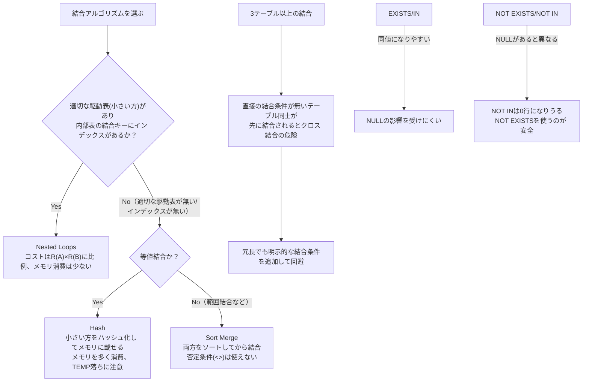

# 結合

## 1. 結合の種類

- クロス結合
- 内部結合
- 外部結合（左外部結合、右外部結合、完全外部結合）
- 自己結合
- 等値結合・非等値結合
- 自然結合

```sql
-- 自然結合では結合条件を記述せず、暗黙のうちに同名の列を基準に結合が行われる
SELECT *
  FROM Employees NATURAL JOIN Departments;

-- 内部結合で書き直すと以下
SELECT *
  FROM Employees E INNER JOIN Departments D
    ON E.dept_id = D.dept_id;
```

自然結合は結合条件が見た目上どこにも書かれないため可読性が良くない。一般的には避け、明示的に結合条件を記述する内部結合を使う。

サンプルテーブル:

| emp_id | emp_name | dept_id |
|--------|----------|---------|
| 001    | 石田     | 10      |
| 002    | 小笠原   | 11      |
| 003    | 夏目     | 11      |
| 004    | 米田     | 12      |
| 005    | 釜本     | 12      |
| 006    | 岩瀬     | 12      |

| dept_id | dept_name |
|---------|-----------|
| 10      | 総務      |
| 11      | 人事      |
| 12      | 開発      |
| 13      | 営業      |

### クロス結合

```sql
SELECT *
  FROM Employees
         CROSS JOIN
           Departments;
```

Employees(6行) × Departments(4行) = 24行の直積になる:

| emp_id | emp_name | dept_id | dept_id | dept_name |
|--------|----------|---------|---------|-----------|
| 001 | 石田   | 10 | 10 | 総務 |
| 002 | 小笠原 | 11 | 10 | 総務 |
| 003 | 夏目   | 11 | 10 | 総務 |
| 004 | 米田   | 12 | 10 | 総務 |
| 005 | 釜本   | 12 | 10 | 総務 |
| 006 | 岩瀬   | 12 | 10 | 総務 |
| 001 | 石田   | 10 | 11 | 人事 |
| 002 | 小笠原 | 11 | 11 | 人事 |
| 003 | 夏目   | 11 | 11 | 人事 |
| 004 | 米田   | 12 | 11 | 人事 |
| 005 | 釜本   | 12 | 11 | 人事 |
| 006 | 岩瀬   | 12 | 11 | 人事 |
| 001 | 石田   | 10 | 12 | 開発 |
| 002 | 小笠原 | 11 | 12 | 開発 |
| 003 | 夏目   | 11 | 12 | 開発 |
| 004 | 米田   | 12 | 12 | 開発 |
| 005 | 釜本   | 12 | 12 | 開発 |
| 006 | 岩瀬   | 12 | 12 | 開発 |
| 001 | 石田   | 10 | 13 | 営業 |
| 002 | 小笠原 | 11 | 13 | 営業 |
| 003 | 夏目   | 11 | 13 | 営業 |
| 004 | 米田   | 12 | 13 | 営業 |
| 005 | 釜本   | 12 | 13 | 営業 |
| 006 | 岩瀬   | 12 | 13 | 営業 |

実務でクロス結合そのものを使う出番はあまり無い。

注意: 結合条件を書き忘れると意図せずクロス結合になる。
```sql
SELECT *
  FROM Employees, Departments;
```
`WHERE`句に結合条件が無いと、これはただのクロス結合になってしまう。クロス結合のコストは非常に高くなる可能性があるため、標準SQL準拠の結合構文（`JOIN ... ON ...`）を必ず使うコーディング規約を定めておくべき。

### 内部結合

```sql
SELECT E.emp_id, E.emp_name, E.dept_id, D.dept_name
  FROM Employees E INNER JOIN Departments D
    ON E.dept_id = D.dept_id;
```
| emp_id | emp_name | dept_id | dept_name |
|--------|----------|---------|-----------|
| 001    | 石田     | 10      | 総務      |
| 002    | 小笠原   | 11      | 人事      |
| 003    | 夏目     | 11      | 人事      |
| 004    | 米田     | 12      | 開発      |
| 005    | 釜本     | 12      | 開発      |
| 006    | 岩瀬     | 12      | 開発      |

内部結合の結果は、必ずクロス結合の結果の部分集合になる。「内部結合の内部」とは「直積（クロス結合）の部分集合」という意味。理論上は「クロス結合してから結合条件を満たす行だけを抽出する」という単純なアルゴリズムで実現できるが、クロス結合のコストが非常に高いため、実際のDBMSはこの単純なアルゴリズムを使わず、より効率的な結合アルゴリズム（後述のNested Loops/Hash/Sort Merge）を使って内部結合を実行する。

内部結合は相関サブクエリでも書き換えられる:
```sql
SELECT E.emp_id, E.emp_name, E.dept_id,
       (SELECT D.dept_name
          FROM Departments D
         WHERE E.dept_id = D.dept_id) AS dept_name
  FROM Employees E;
```

`dept_name`を相関サブクエリで取得できる理由: `SELECT`文は本来テーブルからテーブルを取得するものだが、`Departments`テーブルでは`dept_id`が主キー（一意）なので、この相関サブクエリは必ず1行だけを返すことが保証されている。このように単一の値を返すことが保証されたサブクエリを**スカラサブクエリ**と呼び、通常のサブクエリと異なりSELECT句に書ける。

内部結合とスカラサブクエリのどちらを使うべきか: 基本は結合で記述できる限り結合を選ぶ。相関サブクエリをスカラサブクエリとして使うと、結果行数の数だけ相関サブクエリが実行されることになり、高コストな処理になりやすい。

### 外部結合

- 左外部結合 / 右外部結合
- 完全外部結合

```sql
-- 左外部結合の場合（左のテーブルがマスタ）
SELECT E.emp_id, E.emp_name, E.dept_id, D.dept_name
  FROM Departments D LEFT OUTER JOIN Employees E
    ON D.dept_id = E.dept_id;

-- 右外部結合の場合（右のテーブルがマスタ）
SELECT E.emp_id, E.emp_name, D.dept_id, D.dept_name
  FROM Employees E RIGHT OUTER JOIN Departments D
    ON E.dept_id = D.dept_id;
```

| emp_id | emp_name | dept_id | dept_name |
|--------|----------|---------|-----------|
| 001    | 石田     | 10      | 総務      |
| 002    | 小笠原   | 11      | 人事      |
| 003    | 夏目     | 11      | 人事      |
| 004    | 米田     | 12      | 開発      |
| 005    | 釜本     | 12      | 開発      |
| 006    | 岩瀬     | 12      | 開発      |
| NULL   | NULL     | NULL    | 営業      |

最後の行（`NULL, NULL, NULL, 営業`）はクロス結合では生成されない行。外部結合ではマスタ側のテーブルだけに存在するキー（`13 営業`のように所属する社員が誰もいない部署）を削除せず、不足する列を`NULL`で埋めて結果に残す。クロス結合では生成され得ない行が出てくることから「外部」結合と呼ばれる。

### 自己結合

自己結合を説明するための数字テーブル（0〜9）:
```sql
SELECT D1.digit + (D2.digit * 10) AS seq
  FROM Digits D1 CROSS JOIN Digits D2
 ORDER BY seq;
```
| seq |
|-----|
| 0   |
| 1   |
| 2   |
| ... |
| 98  |
| 99  |

10×10のクロス結合で0〜99の連番を生成できる。

自己結合は「生成される結果の種類」による分類ではなく、「演算の対象に自分自身のテーブルを使うか」による分類。そのため「自己結合＋クロス結合」「自己結合＋外部結合」はあり得るが、結合方式そのものである「内部結合＋外部結合」という組み合わせはあり得ない（結合の種類の直交する軸が違う）。この意味で「自己結合」という分類は他の分類軸（クロス/内部/外部）と同じ並びに置くべきものではない。

## 2. 結合のアルゴリズムとパフォーマンス

代表的な結合アルゴリズムは3つ。

1. Nested Loops（最も頻出）
2. Hash（次に重要）
3. Sort Merge（重要性は一段下がる）

### Nested Loops

SQLでは常に1度に2つのテーブルしか結合しないため、3つ以上のテーブルの結合も実質的にはこの2テーブル結合の繰り返し（二重ループ）になる。

- 駆動表(driving table) / 外部表(outer table): ループの外側で回すテーブル
- 内部表(inner table): ループの内側で回すテーブル

`table_A`と`table_B`を結合する場合の擬似コードイメージ:
```typescript
for (a of table_A) {
  for (b of table_B) {
    ...
  }
}
```
この場合、`table_A`が駆動表、`table_B`が内部表。

`table_A`, `table_B`の行数をそれぞれ`R(A)`, `R(B)`とすると:
- Nested Loopsによる結合のコストは`R(A) * R(B)`に比例する
- 1ステップで処理する行数が少ないため、Hash/Sort Mergeと比べてメモリ消費が少ない
- どのDBMSも必ずサポートする最も基本的な結合方式

「駆動表を小さく」＋「内部表の結合キーをインデックスで効率的にアクセス」することで、Nested Loopsのパフォーマンスを最大化できる。物理ERモデルとインデックスを設計する際は、どのテーブルを内部表にし、どの結合キーにインデックスを作成すべきかを事前に考えておく。

Nested Loopsの落とし穴: 内部表の結合キーにインデックスがあっても、そのキーが内部表に対して一意でない場合、インデックスを辿って複数行を取得する必要がある。結合キーにマッチする内部表の行が多ければ多いほど、Nested Loopsのコストは増大する。

### Hash

まず小さい方のテーブルをスキャンし、結合キーに基づいてハッシュテーブルを作成する。次に大きい方のテーブルをスキャンし、結合キーでハッシュテーブルを参照しながら結合する。

小さいテーブルから作る理由: ハッシュテーブルはDBMSのメモリ上に作られるため、大きいテーブルから作るとメモリを大量に消費してしまう可能性がある。

Hashが選ばれる場面ではテーブルが極端に小さいことは少ない（極端に小さいならNested Loopsの方が効率的な場合が多い）ため、Hashでは（役割としてはNested Loopsの駆動表に近いが）ハッシュ元の小さいテーブルを「駆動表」とは呼ばない。

実際に`Employees`と`Departments`の右外部結合を`EXPLAIN`すると、小さい方の`Departments`（4行）が`Hash`ノードでハッシュテーブルに構築され、大きい方の`Employees`（6行）が直接スキャンされてハッシュテーブルを参照していることが分かる:
```sql
EXPLAIN
SELECT E.emp_id, E.emp_name, D.dept_id, D.dept_name
  FROM Employees E RIGHT OUTER JOIN Departments D
    ON E.dept_id = D.dept_id;

Hash Right Join  (cost=1.09..2.19 rows=6 width=26)
  Hash Cond: (e.dept_id = d.dept_id)
  ->  Seq Scan on employees e  (cost=0.00..1.06 rows=6 width=19)
  ->  Hash  (cost=1.04..1.04 rows=4 width=10)
        ->  Seq Scan on departments d  (cost=0.00..1.04 rows=4 width=10)
```
`Hash`ノードの子が`departments`のSeq Scanであることからも、ハッシュテーブルの構築元は`Departments`（小さい方）であることが読み取れる。

Hashの特徴:
- ハッシュテーブルを作るため、Nested Loopsと比べてメモリを多く消費する
- メモリ内にハッシュテーブルが収まらないとストレージを使うことになり遅延が発生する（Temporary Disk Spill、TEMP落ち）
- ハッシュ値は入力値の順序を保存しないため、等値結合でのみ使用できる

Hashが有効なケース:
- Nested Loopsに適した駆動表（相対的に小さいテーブル）が存在しない場合
- Nested Loopsの落とし穴のように、駆動表として小さいテーブルは指定できても内部表側のヒット件数が多い場合
- Nested Loopsの内部表にインデックスが無い（かつ諸事情でインデックスを追加できない）場合

→ Nested Loopsが効率的に動作しない場合の次善策としてHashを使う。

ただしメモリを多く消費するため、OLTP（オンライン・トランザクション処理）のように短時間で多数の処理を行うシステムではメモリ枯渇のリスクがある。同時実行が少ない夜間バッチや、BI(ビジネスインテリジェンス)/DWH(データウェアハウス)のようなスループット重視のシステムで使いどころを見極めるのがHashの基本戦略。

Hash結合は両テーブルのレコードを全件読み込む必要があるため、テーブルのフルスキャンが採用されることが多い。そもそもHashが採用されるのはNested Loopsに適した小さいテーブルが無い場合が多く、テーブル規模が大きくなりがちなので、フルスキャンの時間も考慮に入れる必要がある。

### Sort Merge (Merge, Merge Join)

Sort Mergeの特徴:
- 対象テーブルを両方ソートするため、Nested Loopsよりも多くメモリを消費する。Hashとの比較はテーブル規模に依るが、Hashは片方のテーブルからハッシュテーブルを作るだけなのに対しSort Mergeは両方のテーブルをソートする必要があるため、Hashより多くメモリを使うこともある
- Hashと違い、等値結合だけでなく不等号を用いた範囲結合でも使用できる。ただし否定条件（`<>`）は結合キーの比較に使えない（否定条件はNested Loopsでのみ利用可能）
- 原理的には、テーブルが結合キーで既にソートされていればソートをスキップできる。ただしSQLではテーブルの行の物理的な並び順は保証されないため、この恩恵を受けられるかどうかは実装依存（結合キーにインデックスが張られていれば、ソートをスキップして高いパフォーマンスを得られる可能性がある）
- 両テーブルをソート済みとして扱うため、内部結合であれば片方のテーブルの走査が終わった時点でこれ以上マッチが無いと判断でき、結合処理を終了できる

ソートに多くの時間とリソースを要する可能性があるので、ソートをスキップできる場合は検討に値するが、それ以外の場面ではNested LoopsやHashが優先的な選択肢になる。

### 意図せぬクロス結合

三角結合（1つのテーブルが残り2つのテーブルそれぞれと結合条件を持つが、その2つのテーブル同士には結合条件がない形）の例:
```sql
SELECT A.col_a, B.col_b, C.col_c
  FROM Table_A A
         INNER JOIN Table_B B
            ON A.col_a = B.col_b
              INNER JOIN Table_C C
                 ON A.col_a = C.col_c;
```

`Table_B`と`Table_C`の間には結合条件が無いため、クロス結合を避けるなら考えられる結合順は以下の4通りに限られる（常に`Table_A`を経由してから相手側と結合する必要がある）。

| 駆動表 | 内部表 | 最後に結合される表 |
|---------|---------|----------------|
| Table_A | Table_B | Table_C |
| Table_A | Table_C | Table_B |
| Table_B | Table_A | Table_C |
| Table_C | Table_A | Table_B |

```sql
EXPLAIN

Merge Join  (cost=475.52..5209.87 rows=288579 width=24)
  Merge Cond: (c.col_c = a.col_a)
  ->  Sort  (cost=158.51..164.16 rows=2260 width=8)
        Sort Key: c.col_c
        ->  Seq Scan on table_c c  (cost=0.00..32.60 rows=2260 width=8)
  ->  Materialize  (cost=317.01..775.23 rows=25538 width=16)
        ->  Merge Join  (cost=317.01..711.38 rows=25538 width=16)
              Merge Cond: (a.col_a = b.col_b)
              ->  Sort  (cost=158.51..164.16 rows=2260 width=8)
                    Sort Key: a.col_a
                    ->  Seq Scan on table_a a  (cost=0.00..32.60 rows=2260 width=8)
              ->  Sort  (cost=158.51..164.16 rows=2260 width=8)
                    Sort Key: b.col_b
                    ->  Seq Scan on table_b b  (cost=0.00..32.60 rows=2260 width=8)
```

この計画では`Table_A`と`Table_B`を先に結合し、その結果に`Table_C`を結合している。この場合クロス結合は発生しない。

しかし場合によっては、オプティマイザが`Table_B`と`Table_C`を先に結合し、最後に`Table_A`と結合する計画を選ぶことがある。`Table_B`と`Table_C`の間には結合条件が無いため、この場合はクロス結合が発生する。

なぜオプティマイザがこのような選択をすることがあるかというと、`Table_B`, `Table_C`のサイズが非常に小さく、逆に`Table_A`のサイズが大きい場合、大きい`Table_A`に2回結合操作を行うより、小さいテーブル同士を先に結合してから大きいテーブルと結合する方が効率的だと判断することがあるため。例えば以下のような組み合わせ:
- 取引明細などの大きなトランザクションテーブル
- 小さな顧客マスタテーブル
- 小さなカレンダーテーブル

小さいテーブル同士のクロス結合はコストが小さいことが多く、むやみに恐れる必要はない。気にすべきなのは大きいテーブルを含むクロス結合。

回避したい場合は`Table_B`と`Table_C`の間に（冗長でも）明示的な結合条件を追加する:
```sql
SELECT A.col_a, B.col_b, C.col_c
  FROM Table_A A
         INNER JOIN Table_B B
            ON A.col_a = B.col_b
               INNER JOIN Table_C C
                  ON A.col_a = C.col_c
                 AND C.col_c = B.col_b;
```

結合の実行計画はテーブルサイズや統計情報によってアルゴリズム・結合順序の選択が揺らぎやすい。可能であれば結合自体を減らす方向で設計し、多テーブルの結合が必要になりがちな相関サブクエリよりウィンドウ関数の活用を検討するのも1つの手。

## 3. EXISTS述語 / NOT EXISTS述語

```sql
SELECT dept_id, dept_name
  FROM Departments D
 WHERE EXISTS (SELECT *
                 FROM Employees E
                WHERE E.dept_id = D.dept_id);
```
| dept_id | dept_name |
|---------|-----------|
| 10      | 総務      |
| 11      | 人事      |
| 12      | 開発      |

```sql
EXPLAIN

Hash Right Semi Join  (cost=1.09..2.21 rows=3 width=10)
  Hash Cond: (e.dept_id = d.dept_id)
  ->  Seq Scan on employees e  (cost=0.00..1.06 rows=6 width=3)
  ->  Hash  (cost=1.04..1.04 rows=4 width=10)
        ->  Seq Scan on departments d  (cost=0.00..1.04 rows=4 width=10)
```

**Semi Join（半結合）**: `EXISTS`述語は内部的にこのSemi Joinを利用していることが多い。
- 機能的には、結果には駆動表（`Departments`）のデータしか含まれず、1行につき必ず1行しか結果が生成されない（通常の結合では1対Nの関係があると複数行生成される可能性がある）
- 内部表にマッチする行を1行でも見つけた時点で残りの行の探索を打ち切るため、通常の結合よりパフォーマンスが良い。例: `dept_id = 12`の行は「米田」「釜本」「岩瀬」の3行あるが、このうち最初の1行を見つけた時点で探索を打ち切る

`EXISTS`述語はこのようにSemi Joinを利用して効率的に処理されるので、使える場面では積極的に利用してよい。

```sql
SELECT dept_id, dept_name
  FROM Departments D
 WHERE NOT EXISTS (SELECT *
                     FROM Employees E
                    WHERE E.dept_id = D.dept_id);
```

```sql
EXPLAIN

Hash Right Anti Join  (cost=1.09..2.21 rows=1 width=10)
  Hash Cond: (e.dept_id = d.dept_id)
  ->  Seq Scan on employees e  (cost=0.00..1.06 rows=6 width=3)
  ->  Hash  (cost=1.04..1.04 rows=4 width=10)
        ->  Seq Scan on departments d  (cost=0.00..1.04 rows=4 width=10)
```

**Anti Join（反結合）**: `NOT EXISTS`述語は内部的にこのAnti Joinを利用していることが多い。やっていることはSemi Joinと同じで、最後に駆動表から`EXISTS`の条件を満たした行を取り除くだけなので、こちらも効率的に処理される。

### EXISTS/INとNOT EXISTS/NOT INの違い

`EXISTS`と`IN`は基本的に同じ結果になる。「所属している部下が1人以上いる部署」を求める場合:
```sql
-- EXISTS版
SELECT dept_id, dept_name FROM Departments D
 WHERE EXISTS (SELECT * FROM Employees E WHERE E.dept_id = D.dept_id);

-- IN版
SELECT dept_id, dept_name FROM Departments D
 WHERE D.dept_id IN (SELECT dept_id FROM Employees);
```
両方とも同じ結果（`10 総務`, `11 人事`, `12 開発`）になり、実行計画も同じになりやすい。

しかし`NOT EXISTS`と`NOT IN`は結果が違うことがある。原因はSQLの三値論理（NULLとの比較は`TRUE`/`FALSE`ではなく`UNKNOWN`になる）。`Employees.dept_id`にNULLが1件でも混ざっていると`NOT IN`は正しく動かなくなる。

検証のため、`Employees`に「`007 未配属太郎`, `dept_id = NULL`」という行を1件追加したテスト用テーブルで確認した（本物のテーブルは変更していない）:
```sql
SELECT dept_id, dept_name FROM Departments D
 WHERE NOT EXISTS (SELECT * FROM Employees E WHERE E.dept_id = D.dept_id);
-- → 13 営業（正しく、部下が誰もいない部署が返る）

SELECT dept_id, dept_name FROM Departments D
 WHERE D.dept_id NOT IN (SELECT dept_id FROM Employees);
-- → 0行（13 営業すら返らない）
```

なぜ`NOT IN`が0行になるか: `NOT IN (10, 11, 12, NULL)`は展開すると

```
dept_id <> 10 AND dept_id <> 11 AND dept_id <> 12 AND dept_id <> NULL
```

という意味になる。最後の`dept_id <> NULL`はNULLとの比較なので常に`UNKNOWN`になる。`AND`の中に1つでも`UNKNOWN`が混じると、他の3つが全部`TRUE`でも全体は`TRUE`にならず`UNKNOWN`になり、`WHERE`句では除外扱いになる。結果として`dept_id`の値に関係なく全行が除外され、`13 営業`のような本来該当する部署も含めて0行になる。

一方`NOT EXISTS`はサブクエリ内で`E.dept_id = D.dept_id`という比較を1行ずつ行うだけで、`Employees`のNULL行は単に「マッチしない行」として扱われ、`NOT EXISTS`（マッチする行が1つも無いか）の判定自体には影響しない。そのためNULLがあっても正しく動く。

| | サブクエリにNULLが無い場合 | サブクエリにNULLがある場合 |
|---|---|---|
| `EXISTS` / `IN` | 同値 | 同値（`IN`側もNULLの影響を受けにくい） |
| `NOT EXISTS` / `NOT IN` | 同値 | `NOT IN`は0行になりうる（`NOT EXISTS`は正しく動く） |

実務上の教訓: サブクエリの列がNULLを含む可能性がある場合、`NOT IN`は使わず`NOT EXISTS`を使うのが安全。

## まとめ



- 結合アルゴリズムはNested Loops→Hash→Sort Mergeの順に頻出。駆動表の大きさとインデックスの有無で選択が決まる
- 3テーブル以上の結合では、直接の結合条件を持たないテーブル同士が意図せずクロス結合される場合がある。テーブルサイズが小さければ実害は小さいが、大きいテーブルが絡む場合は明示的な結合条件で防ぐ
- `EXISTS`/`IN`は同値になりやすいが、`NOT EXISTS`/`NOT IN`はNULLの扱いが異なるため同値にならないことがある。NULLを含みうる列に対しては`NOT IN`を避け`NOT EXISTS`を使う
