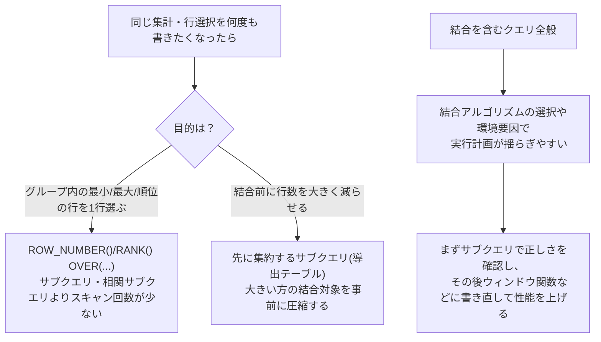

# サブクエリ 困難は分割するべきか

## 1. サブクエリが引き起こす弊害

- サブクエリの計算コストが上乗せされる: 実体的なデータを保持しないので、参照するたびに毎回計算が必要になる
- データのI/Oコストが増大する: サブクエリの計算結果は一時的に保持される必要があることが多く、ディスクやメモリへのアクセスが増える
- 最適化を受けられない: サブクエリが作るデータは構造的にはテーブルと変わらないが、明示的に制約やインデックスが作成される実テーブルと異なりメタ情報が一切無い。そのためオプティマイザがクエリを解析するために必要な情報が、サブクエリの結果からは得られない

### サブクエリ・パラノイア

購入明細テーブル:

| cust_id | seq | price |
|---------|-----|-------|
| A       | 1   | 500   |
| A       | 2   | 1000  |
| A       | 3   | 700   |
| B       | 5   | 100   |
| B       | 6   | 5000  |
| B       | 7   | 300   |
| B       | 9   | 200   |
| B       | 12  | 1000  |
| C       | 10  | 600   |
| C       | 20  | 100   |
| C       | 45  | 200   |
| C       | 70  | 50    |
| D       | 3   | 2000  |

各顧客の最も古い（`seq`が最小の）購入明細を取得したい。

**サブクエリを使った解**
```sql
SELECT R1.cust_id, R1.seq, R1.price
  FROM Receipts R1
         INNER JOIN
           (SELECT cust_id, MIN(seq) AS min_seq
              FROM Receipts
             GROUP BY cust_id) R2
    ON R1.cust_id = R2.cust_id
   AND R1.seq = R2.min_seq;
```
| cust_id | seq | price |
|---------|-----|-------|
| A       | 1   | 500   |
| B       | 5   | 100   |
| C       | 10  | 600   |
| D       | 3   | 2000  |

各顧客の最小の`seq`を保持するサブクエリ（`R2`）を作り、それを本体の`Receipts`テーブル（`R1`）と結合することで、各顧客の最も古い購入明細を取得している。

欠点:
- コードが複雑で読みにくい
- パフォーマンスが良くない
  - サブクエリの結果は多くの場合一時領域に確保され、オーバーヘッドが生じる
  - サブクエリはインデックスや制約の情報を持たないため最適化を受けにくい。`R2`が`(cust_id, seq)`で一意になることは人間には自明でも、オプティマイザはその情報を持たないため、`R1`との結合で効率的な実行計画を立てにくい
  - `Receipts`テーブルのスキャンが2回必要になる

```sql
EXPLAIN

Hash Join  (cost=1.29..2.49 rows=1 width=10)
  Hash Cond: ((r1.cust_id = receipts.cust_id) AND (r1.seq = (min(receipts.seq))))
  ->  Seq Scan on receipts r1  (cost=0.00..1.13 rows=13 width=10)
  ->  Hash  (cost=1.23..1.23 rows=4 width=6)
        ->  HashAggregate  (cost=1.19..1.23 rows=4 width=6)
              Group Key: receipts.cust_id
              ->  Seq Scan on receipts  (cost=0.00..1.13 rows=13 width=6)
```

**相関サブクエリの解**
```sql
SELECT cust_id, seq, price
  FROM Receipts R1
 WHERE seq = (SELECT MIN(seq)
                FROM Receipts R2
               WHERE R1.cust_id = R2.cust_id);
```

```sql
EXPLAIN

Seq Scan on receipts r1  (cost=0.00..16.50 rows=1 width=10)
  Filter: (seq = (SubPlan 1))
  SubPlan 1
    ->  Aggregate  (cost=1.17..1.18 rows=1 width=4)
          ->  Seq Scan on receipts r2  (cost=0.00..1.16 rows=3 width=4)
                Filter: (r1.cust_id = cust_id)
```

相関サブクエリでもテーブルへのスキャンは実質2回必要であり、パフォーマンスの面ではあまり改善されない。

**ウィンドウ関数による解**
```sql
SELECT cust_id, seq, price
  FROM (SELECT cust_id, seq, price,
               ROW_NUMBER()
                 OVER (PARTITION BY cust_id
                           ORDER BY seq) AS row_seq
          FROM Receipts ) WORK
 WHERE WORK.row_seq = 1;
```

```sql
EXPLAIN

Subquery Scan on work  (cost=1.39..1.79 rows=1 width=10)
  Filter: (work.row_seq = 1)
  ->  WindowAgg  (cost=1.39..1.63 rows=13 width=18)
        Window: w1 AS (PARTITION BY receipts.cust_id ORDER BY receipts.seq ROWS UNBOUNDED PRECEDING)
        Run Condition: (row_number() OVER w1 <= 1)
        ->  Sort  (cost=1.37..1.40 rows=13 width=10)
              Sort Key: receipts.cust_id, receipts.seq
              ->  Seq Scan on receipts  (cost=0.00..1.13 rows=13 width=10)
```

`ROW_NUMBER()`で各顧客内の行に連番を振り、常に最小の`seq`を1にすることで、「`seq`の最小値が何か分からない」という問題に対処できる。テーブルスキャンの回数も1回になり、パフォーマンスが改善される。

参考: この`ROW_NUMBER()`が実際にどの値を返すか（`min_seq`/`max_seq`の全件）:
```sql
SELECT cust_id, seq, price,
       ROW_NUMBER() OVER (PARTITION BY cust_id ORDER BY seq) AS row_seq
  FROM Receipts;
```
| cust_id | seq | price | row_seq |
|---------|-----|-------|---------|
| A       | 1   | 500   | 1       |
| A       | 2   | 1000  | 2       |
| A       | 3   | 700   | 3       |
| B       | 5   | 100   | 1       |
| B       | 6   | 5000  | 2       |
| B       | 7   | 300   | 3       |
| B       | 9   | 200   | 4       |
| B       | 12  | 1000  | 5       |
| C       | 10  | 600   | 1       |
| C       | 20  | 100   | 2       |
| C       | 45  | 200   | 3       |
| C       | 70  | 50    | 4       |
| D       | 3   | 2000  | 1       |

### 長期的な視野でのリスクマネジメント

結合を使うクエリには2つの不安定要因がある。
- 結合アルゴリズムの選択が変動するリスク
- 環境起因の遅延リスク（インデックス、メモリ、パラメータなど）

相関サブクエリも実行計画としてはほぼ結合と同等であり、同様の不安定要因を持つ。→ シンプルな実行計画ほど性能が安定しやすい。

**サブクエリ・パラノイア その2**: 各顧客の「最古の購入」と「最新の購入」の価格差を求める。

サブクエリを2段階で結合する解:
```sql
SELECT TMP_MIN.cust_id,
       TMP_MIN.price - TMP_MAX.price AS diff
  FROM (SELECT R1.cust_id, R1.seq, R1.price
          FROM Receipts R1
                 INNER JOIN
                  (SELECT cust_id, MIN(seq) AS min_seq
                     FROM Receipts
                    GROUP BY cust_id) R2
            ON R1.cust_id = R2.cust_id
           AND R1.seq = R2.min_seq) TMP_MIN
       INNER JOIN
       (SELECT R3.cust_id, R3.seq, R3.price
          FROM Receipts R3
                 INNER JOIN
                  (SELECT cust_id, MAX(seq) AS min_seq
                     FROM Receipts
                    GROUP BY cust_id) R4
            ON R3.cust_id = R4.cust_id
           AND R3.seq = R4.min_seq) TMP_MAX
    ON TMP_MIN.cust_id = TMP_MAX.cust_id;
```
| cust_id | diff |
|---------|------|
| A       | -200 |
| B       | -900 |
| C       | 550  |
| D       | 0    |

```sql
EXPLAIN

Nested Loop  (cost=2.62..4.93 rows=1 width=6)
  Join Filter: (r3.seq = (max(receipts_1.seq)))
  ->  Nested Loop  (cost=2.49..3.78 rows=1 width=14)
        Join Filter: (r1.cust_id = receipts_1.cust_id)
        ->  Hash Join  (cost=1.29..2.49 rows=1 width=8)
              Hash Cond: ((r1.cust_id = receipts.cust_id) AND (r1.seq = (min(receipts.seq))))
              ->  Seq Scan on receipts r1  (cost=0.00..1.13 rows=13 width=10)
              ->  Hash  (cost=1.23..1.23 rows=4 width=6)
                    ->  HashAggregate  (cost=1.19..1.23 rows=4 width=6)
                          Group Key: receipts.cust_id
                          ->  Seq Scan on receipts  (cost=0.00..1.13 rows=13 width=6)
        ->  HashAggregate  (cost=1.19..1.23 rows=4 width=6)
              Group Key: receipts_1.cust_id
              ->  Seq Scan on receipts receipts_1  (cost=0.00..1.13 rows=13 width=6)
  ->  Index Scan using receipts_pkey on receipts r3  (cost=0.14..1.11 rows=3 width=10)
        Index Cond: (cust_id = r1.cust_id)
```

可読性が低く、テーブルへのSeq Scan 3回＋Index Scan 1回になっており、パフォーマンスが悪い。

**ウィンドウ関数とCASE式による解**:
```sql
SELECT cust_id,
       SUM(CASE WHEN min_seq = 1 THEN price ELSE 0 END)
         - SUM(CASE WHEN max_seq = 1 THEN price ELSE 0 END) AS diff
  FROM (SELECT cust_id, price,
               ROW_NUMBER() OVER (PARTITION BY cust_id
                                      ORDER BY seq) AS min_seq,
               ROW_NUMBER() OVER (PARTITION BY cust_id
                                      ORDER BY seq DESC) AS max_seq
          FROM Receipts ) WORK
 WHERE WORK.min_seq = 1
    OR WORK.max_seq = 1
 GROUP BY cust_id;
```

```sql
EXPLAIN

GroupAggregate  (cost=1.53..2.46 rows=2 width=10)
  Group Key: work.cust_id
  ->  Subquery Scan on work  (cost=1.53..2.41 rows=2 width=22)
        Filter: ((work.min_seq = 1) OR (work.max_seq = 1))
        ->  WindowAgg  (cost=1.53..2.21 rows=13 width=26)
              Window: w2 AS (PARTITION BY receipts.cust_id ORDER BY receipts.seq ROWS UNBOUNDED PRECEDING)
              ->  Incremental Sort  (cost=1.48..1.98 rows=13 width=18)
                    Sort Key: receipts.cust_id, receipts.seq
                    Presorted Key: receipts.cust_id
                    ->  WindowAgg  (cost=1.39..1.63 rows=13 width=18)
                          Window: w1 AS (PARTITION BY receipts.cust_id ORDER BY receipts.seq ROWS UNBOUNDED PRECEDING)
                          ->  Sort  (cost=1.37..1.40 rows=13 width=10)
                                Sort Key: receipts.cust_id, receipts.seq DESC
                                ->  Seq Scan on receipts  (cost=0.00..1.13 rows=13 width=10)
```

テーブルへのSeq Scanが1回、ソートが昇順・降順の両方で合計2回行われている。スキャンの回数が少なく、ソートはあるものの、全体的なパフォーマンスはサブクエリを使った場合よりも良い。

ただしサブクエリ自体が悪いわけではなく、思考の補助線として使うのは有効。最初はサブクエリで組み立てて正しさを確認し、その後ウィンドウ関数に書き直してパフォーマンスを改善する、という進め方でよい。

参考: `min_seq`/`max_seq`を両方出した全件結果。
```sql
SELECT cust_id, price,
       ROW_NUMBER() OVER (PARTITION BY cust_id ORDER BY seq) AS min_seq,
       ROW_NUMBER() OVER (PARTITION BY cust_id ORDER BY seq DESC) AS max_seq
  FROM Receipts;
```
| cust_id | price | min_seq | max_seq |
|---------|-------|---------|---------|
| A       | 500   | 1       | 3       |
| A       | 1000  | 2       | 2       |
| A       | 700   | 3       | 1       |
| B       | 100   | 1       | 5       |
| B       | 5000  | 2       | 4       |
| B       | 300   | 3       | 3       |
| B       | 200   | 4       | 2       |
| B       | 1000  | 5       | 1       |
| C       | 600   | 1       | 4       |
| C       | 100   | 2       | 3       |
| C       | 200   | 3       | 2       |
| C       | 50    | 4       | 1       |
| D       | 2000  | 1       | 1       |

列を`max_seq`, `min_seq`の順に書き替えても結果は変わらない:
```sql
SELECT cust_id, price,
       ROW_NUMBER() OVER (PARTITION BY cust_id ORDER BY seq DESC) AS max_seq,
       ROW_NUMBER() OVER (PARTITION BY cust_id ORDER BY seq) AS min_seq
  FROM Receipts;
```
| cust_id | price | max_seq | min_seq |
|---------|-------|---------|---------|
| A       | 500   | 3       | 1       |
| A       | 1000  | 2       | 2       |
| A       | 700   | 1       | 3       |
| B       | 100   | 5       | 1       |
| B       | 5000  | 4       | 2       |
| B       | 300   | 3       | 3       |
| B       | 200   | 2       | 4       |
| B       | 1000  | 1       | 5       |
| C       | 600   | 4       | 1       |
| C       | 100   | 3       | 2       |
| C       | 200   | 2       | 3       |
| C       | 50    | 1       | 4       |
| D       | 2000  | 1       | 1       |

### `OVER`の`ORDER BY`はウィンドウ関数ごとに完全に独立している

`min_seq`と`max_seq`で`ORDER BY`の向きが違う（`ORDER BY seq` / `ORDER BY seq DESC`）のに、なぜお互いに干渉せず、それぞれ正しく計算できるのか。

種を明かすと、`ROW_NUMBER()`にも`ORDER BY`にも「秘密」は無く、**`OVER(...)`という括弧の中身1つにつき、独立した1つの計算（自分専用のパーティション分け＋並び替え）が行われるだけ**、というのが実装の全体像。1つのSELECT文に複数の`OVER(...)`を書いても、それぞれの`OVER(...)`は他の`OVER(...)`の存在を一切知らない。「最初のORDER BYが優先されて、その並び替えられた状態に対して次のORDER BY DESCが適用される」という直列処理（カスケード）は起きていない。

列の順序を入れ替えても結果が変わらないこと（直前の2つの例）が、この独立性の証拠。もし「先に書いた方のORDER BYが優先されて他方に影響する」なら、順序を入れ替えれば結果も変わるはずだが、実際は変わらない。

実際に`EXPLAIN`を見ると、`ORDER BY`の向きが違う2つのウィンドウ関数はそれぞれ別の`Sort`＋`WindowAgg`のペアとして処理されていることが分かる:
```sql
EXPLAIN
SELECT cust_id, seq, price,
       ROW_NUMBER() OVER (PARTITION BY cust_id ORDER BY seq) AS min_seq,
       ROW_NUMBER() OVER (PARTITION BY cust_id ORDER BY seq DESC) AS max_seq
  FROM Receipts;

WindowAgg  (cost=1.53..2.21 rows=13 width=26)
  Window: w2 AS (PARTITION BY cust_id ORDER BY seq ROWS UNBOUNDED PRECEDING)
  ->  Incremental Sort  (cost=1.48..1.98 rows=13 width=18)
        Sort Key: cust_id, seq
        Presorted Key: cust_id
        ->  WindowAgg  (cost=1.39..1.63 rows=13 width=18)
              Window: w1 AS (PARTITION BY cust_id ORDER BY seq ROWS UNBOUNDED PRECEDING)
              ->  Sort  (cost=1.37..1.40 rows=13 width=10)
                    Sort Key: cust_id, seq DESC
                    ->  Seq Scan on receipts  (cost=0.00..1.13 rows=13 width=10)
```
`max_seq`（`ORDER BY seq DESC`）用に`Sort Key: cust_id, seq DESC`で並べ替えて`WindowAgg`（`w1`）を計算した後、`min_seq`（`ORDER BY seq`昇順）用にもう一度`Sort Key: cust_id, seq`で並べ替えて`WindowAgg`（`w2`）を計算している。2回の完全に別なソート＋集計になっており、片方の並び替えがもう片方に影響を与えることはない。

なお、この`EXPLAIN`結果からもう1つ分かる重要な点: **クエリ全体の行の出力順序は、`ORDER BY`を明示しない限り保証されない。** 元のクエリの結果がたまたま`seq`昇順に見えるのは、プランナが最後に実行したのが`w2`（昇順）用の`Sort`だったから、その並びがそのまま出力に「漏れ出ている」に過ぎない。プランナの選択（統計情報やデータ量次第）が変われば、この見た目の順序も変わりうる。行の順序を保証したい場合は、必ず外側に`ORDER BY`を明示する必要がある。

### 異なる`PARTITION BY`を1つのSELECT文で混在させることはできるか

できる。`OVER(...)`は呼び出し1つごとに独立しているので、`PARTITION BY`や`ORDER BY`の内容がそれぞれ違っていても全く問題ない:
```sql
SELECT cust_id, seq, price,
       ROW_NUMBER() OVER (PARTITION BY cust_id ORDER BY seq) AS a,
       ROW_NUMBER() OVER (PARTITION BY seq) AS b
  FROM Receipts
 ORDER BY cust_id, seq;
```
| cust_id | seq | price | a | b |
|---------|-----|-------|---|---|
| A       | 1   | 500   | 1 | 1 |
| A       | 2   | 1000  | 2 | 1 |
| A       | 3   | 700   | 3 | 2 |
| B       | 5   | 100   | 1 | 1 |
| B       | 6   | 5000  | 2 | 1 |
| B       | 7   | 300   | 3 | 1 |
| B       | 9   | 200   | 4 | 1 |
| B       | 12  | 1000  | 5 | 1 |
| C       | 10  | 600   | 1 | 1 |
| C       | 20  | 100   | 2 | 1 |
| C       | 45  | 200   | 3 | 1 |
| C       | 70  | 50    | 4 | 1 |
| D       | 3   | 2000  | 1 | 1 |

`a`は`cust_id`ごとのパーティションで`seq`昇順の連番、`b`は`seq`の値そのものでパーティションを切った連番（この`Receipts`データでは`seq`の値が重複しないので`b`は常に1になる）。`a`と`b`はそれぞれ完全に別の「範囲（パーティション）」で計算されており、互いに影響しない。

`EXPLAIN`でもこれが確認できる。`PARTITION BY`が異なる2つのウィンドウ関数は、それぞれ別の`Sort`＋`WindowAgg`として実行される:
```sql
WindowAgg  (cost=1.87..2.10 rows=13 width=26)
  Window: w2 AS (PARTITION BY seq ROWS UNBOUNDED PRECEDING)
  ->  Sort  (cost=1.87..1.90 rows=13 width=18)
        Sort Key: seq
        ->  WindowAgg  (cost=1.39..1.63 rows=13 width=18)
              Window: w1 AS (PARTITION BY cust_id ORDER BY seq ROWS UNBOUNDED PRECEDING)
              ->  Sort  (cost=1.37..1.40 rows=13 width=10)
                    Sort Key: cust_id, seq
                    ->  Seq Scan on receipts  (cost=0.00..1.13 rows=13 width=10)
```

まとめると、`OVER(...)`は`PARTITION BY`・`ORDER BY`・フレームの3点セットを1回の呼び出しごとに完結して定義するものであり、1つのSELECT文に何個書いても、それぞれ独立に計算される。複数のウィンドウ関数が同じ`PARTITION BY`/`ORDER BY`を共有する場合、プランナがソートを1回にまとめて再利用することはあるが（`Presorted Key`のように）、これは実行計画上の最適化であって、意味的な独立性そのものは常に保たれる。

## 2. サブクエリの積極的な意味（サブクエリの方が良いケース）

サブクエリの使用を検討する価値が性能面で特に大きいのは、結合が関係するクエリ。結合においてはなるべく対象の行数を小さく絞ることが重要だが、オプティマイザがうまく判断できない場合に、人間が演算順序を明示するようにコーディングすることで良好なパフォーマンスを実現できる。

会社テーブル:
| co_cd | district |
|-------|----------|
| 001   | A        |
| 002   | B        |
| 003   | C        |
| 004   | D        |

事業所テーブル:
| co_cd | shop_id | emp_nbr | main_flg |
|-------|---------|---------|----------|
| 001   | 1       | 300     | Y        |
| 001   | 2       | 400     | N        |
| 001   | 3       | 250     | Y        |
| 002   | 1       | 100     | Y        |
| 002   | 2       | 20      | N        |
| 003   | 1       | 400     | Y        |
| 003   | 2       | 500     | Y        |
| 003   | 3       | 300     | N        |
| 003   | 4       | 200     | Y        |
| 004   | 1       | 999     | Y        |

やりたいこと: 会社ごとに、主要事業所（`main_flg = 'Y'`）の従業員数を合計する。
| co_cd | district | sum_emp |
|-------|----------|---------|
| 001   | A        | 550     |
| 002   | B        | 100     |
| 003   | C        | 1100    |
| 004   | D        | 999     |

### 解1: 結合を先に行う
```sql
SELECT C.co_cd, C.district,
       SUM(emp_nbr) AS sum_emp
  FROM Companies C
         INNER JOIN
           Shops S
    ON C.co_cd = S.co_cd
 WHERE main_flg = 'Y'
 GROUP BY C.co_cd;
```
```sql
EXPLAIN

HashAggregate  (cost=2.29..2.33 rows=4 width=14)
  Group Key: c.co_cd
  ->  Hash Join  (cost=1.09..2.26 rows=7 width=10)
        Hash Cond: (s.co_cd = c.co_cd)
        ->  Seq Scan on shops s  (cost=0.00..1.12 rows=7 width=8)
              Filter: (main_flg = 'Y'::bpchar)
        ->  Hash  (cost=1.04..1.04 rows=4 width=6)
              ->  Seq Scan on companies c  (cost=0.00..1.04 rows=4 width=6)
```

### 解2: 集約を先に行う
```sql
SELECT C.co_cd, C.district, sum_emp
  FROM Companies C
         INNER JOIN
          (SELECT co_cd,
                  SUM(emp_nbr) AS sum_emp
             FROM Shops
            WHERE main_flg = 'Y'
            GROUP BY co_cd) CSUM
    ON C.co_cd = CSUM.co_cd;
```
```sql
EXPLAIN

Hash Join  (cost=1.29..2.35 rows=4 width=14)
  Hash Cond: (c.co_cd = csum.co_cd)
  ->  Seq Scan on companies c  (cost=0.00..1.04 rows=4 width=6)
  ->  Hash  (cost=1.24..1.24 rows=4 width=12)
        ->  Subquery Scan on csum  (cost=1.16..1.24 rows=4 width=12)
              ->  HashAggregate  (cost=1.16..1.20 rows=4 width=12)
                    Group Key: shops.co_cd
                    ->  Seq Scan on shops  (cost=0.00..1.12 rows=7 width=8)
                          Filter: (main_flg = 'Y'::bpchar)
```

このサンプルデータでは:
- 解1: 会社テーブル4行、事業所テーブル10行
- 解2: 会社テーブル4行、集約後の事業所テーブル(CSUM)4行

というレベルの規模なので、コスト（2.33 vs 2.35）はほぼ同じ。しかし一般的には事業所は会社の傘下にはるかに多く存在する。例えば:
- 会社テーブル 1000行
- 事業所テーブル（`main_flg = 'Y'`） 500万行
- 集約後の事業所テーブル(CSUM) 1000行

このような規模になると、解2の方が圧倒的に効率的になる。解1では500万行を会社テーブルと結合してから集約するのに対し、解2では500万行の集約自体は避けられないが、結合するのは集約済みの1000行同士で済むため、結合コストを大きく削減できる。

ただし解2はサブクエリなので、その結果がメモリに保持されることになり、大量データを扱う場合は注意が必要（上記の想定でもそれで十分に見返りがあるので問題にはならない）。

解1・解2のどちらが速いかはかなりの程度環境に依存する。テーブルの行数だけでなく、ハードウェアやミドルウェア、選択されるアルゴリズムなども影響する。実際の開発ではこうした要因も考慮した上で性能試験を実施し、最終的な判断を行う必要がある。それでも、チューニングの選択肢として「先に行数を絞るためにサブクエリで事前集約する」という手法があることは知っておくべき。

**ビューマージ**: 解2のようにサブクエリ（導出テーブル）を使って書いても、オプティマイザがそのサブクエリを展開し、内部と外部を同じレベルで評価して結合を先に行う計画（解1相当）に書き換えてしまう場合がある。この最適化を「ビューマージ」と呼ぶ。

オプティマイザがビューマージを行う理由:
- 結合によって結果行数を大きく減らせる可能性がある場合。それによって集約対象の行数も減り、全体コストが下がることが期待できる
- 効率的にアクセスできる条件やインデックスが存在する場合。例えば`pk_Companies`のような主キーインデックスがあれば、それを使ったNested Loopsの方が効率的だとオプティマイザが判断することもある。同様にパーティションが使える場合もビューマージが選択される要因になりうる

## まとめ



- サブクエリは実体を持たず、参照するたびに再計算されメタ情報も持たないため、多用すると可読性・性能の両面で不利になりやすい（サブクエリ・パラノイア）
- 「グループごとに1行選ぶ」系の処理は、サブクエリ・相関サブクエリよりウィンドウ関数（`ROW_NUMBER`など）の方がスキャン回数が少なく済むことが多い
- `OVER(...)`は呼び出し単位で完全に独立している。`PARTITION BY`/`ORDER BY`が異なる複数のウィンドウ関数を1つのSELECT文に混在させても問題なく、互いに影響しない
- 一方、大きいテーブルを結合する前に集約して行数を絞る場合は、サブクエリ（導出テーブル）を使う方が有利になることがある。ただしオプティマイザがビューマージでその意図を「解除」してしまう場合もある
